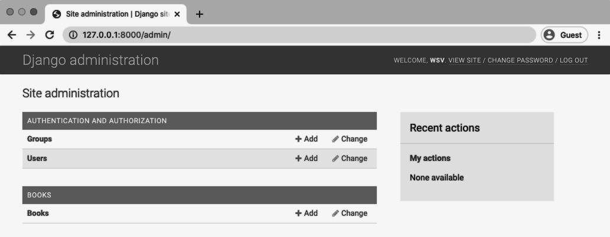
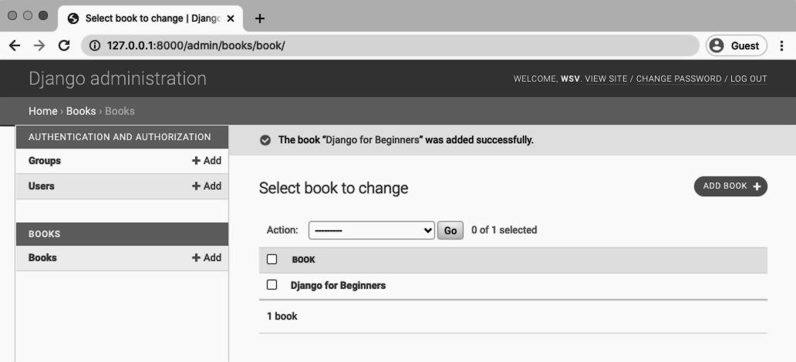
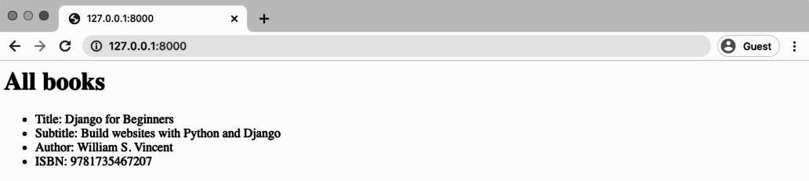
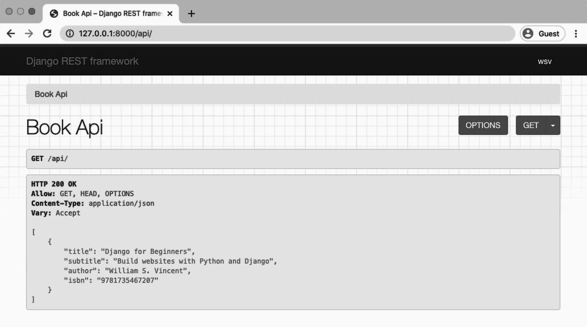
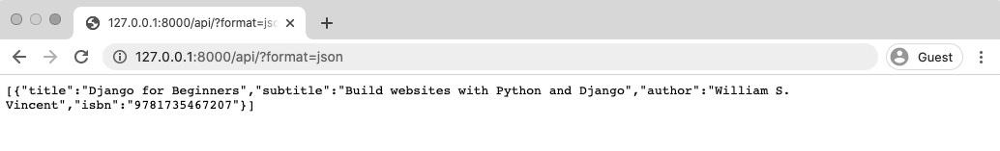

<div dir="rtl">

# Library Website and API

Django REST Framework works alongside the Django web framework to create web APIs. We
cannot build a web API with only Django Rest Framework; it always must be added to a project
after Django itself has been installed and configured.

In this chapter, we will review the similarities and differences between traditional Django
and Django REST Framework. The most important takeaway is that Django creates websites
containing webpages, while Django REST Framework creates web APIs which are a collection
of URL endpoints containing available HTTP verbs that return JSON.

To illustrate these concepts, we will build out a basic Library website with traditional Django and
then extend it into a web API with Django REST Framework.

Make sure you already have Python 3 and Pipenv22 installed on your computer. Complete
instructions can be found here23 if you need help.

### Traditional Django

First, we need a dedicated directory on our computer to store the code. This can live anywhere
but for convenience, if you are on a Mac, we can place it in the Desktop folder. The location really
does not matter; it just needs to be easily accessible.

<div dir="ltr">

```shelll
$ cd ~/Desktop
$ mkdir code && cd code
```

</div>

This code folder will be the location for all the code in this book. The next step is to create a
dedicated directory for our library site, install Django via Pipenv, and then enter the virtual
environment using the shell command. You should always use a dedicated virtual environment
for every new Python project.

<div dir="ltr">

```shell
$ mkdir library && cd library
$ pipenv install django~=3.1.0
$ pipenv shell
(library) $
```

</div>

Pipenv creates a Pipfile and a Pipfile.lock within our current directory. The (library) in
parentheses before the command line shows that our virtual environment is active.

A traditional Django website consists of a single project and one (or more) apps representing
discrete functionality. Let’s create a new project with the startproject command. Don’t forget
to include the period . at the end which installs the code in our current directory. If you do not
include the period, Django will create an additional directory by default.

<div dir="ltr">

```shell
(library) $ django-admin startproject config .
```

</div>

Django automatically generates a new project for us which we can see with the tree command.
(Note: If tree doesn’t work for you on a Mac, install it with Homebrew24 : brew install tree.)

<div dir="ltr">

```shell
(library) $ tree
.
├── Pipfile
├── Pipfile.lock
├── config
│
├── __init__.py
│
├── asgi.py
│
├── settings.py
│
├── urls.py
│
└── wsgi.py
└── manage.py

1 directory, 8 files
```

</div>

The files have the following roles:

- `__init__.py` is a Python way to treat a directory as a package; it is empty
- asgi.py stands for Asynchronous Server Gateway Interface and is a new option in Django
3.0+
- settings.py contains all the configuration for our project
- urls.py controls the top-level URL routes
- wsgi.py stands for Web Server Gateway Interface and helps Django serve the eventual web
pages
- manage.py executes various Django commands such as running the local web server or
creating a new app.

Run migrate to sync the database with Django’s default settings and start up the local Django
web server.

<div dir="ltr">

```shell
(library) $ python manage.py migrate
(library) $ python manage.py runserver
```

</div>

Open a web browser to http://127.0.0.1:8000/25 to confirm our project is successfully installed.


### First App

The typical next step is to start adding apps, which represent discrete areas of functionality. A
single Django project can support multiple apps.

Stop the local server by typing Control+c and then create a books app.

<div dir="ltr">

```shell
(library) $ python manage.py startapp books
```

</div>

Now let’s see what files Django has generated.

<div dir="ltr">

```shell
(library) $ tree
.
├── Pipfile
├── Pipfile.lock
├── books
│
├── __init__.py
│
├── admin.py
│
├── apps.py
│
├── migrations
│
│
└── __init__.py
│
├── models.py
│
├── tests.py
│
└── views.py
├── config
│
├── __init__.py
│
├── asgi.py
│
├── settings.py
│
├── urls.py
│
└── wsgi.py
├── db.sqlite3
└── manage.py
```

</div>

Each app has a `__init__.py` file identifying it as a Python package. There are 6 new files created:

- admin.py is a configuration file for the built-in Django Admin app
- apps.py is a configuration file for the app itself
- the migrations/ directory stores migrations files for database changes
- models.py is where we define our database models
- tests.py is for our app-specific tests
- views.py is where we handle the request/response logic for our web app

Typically, developers will also create an urls.py file within each app, too, for routing.

Let’s build out the files so that our Library project lists out all books on the homepage. Open the
text editor of your choice to the config/settings.py file. The first step is to add the new app to
our INSTALLED_APPS configuration.

<div dir="ltr">

```python
# config/settings.py
INSTALLED_APPS = [
    'django.contrib.admin',
    'django.contrib.auth',
    'django.contrib.contenttypes',
    'django.contrib.sessions',
    'django.contrib.messages',
    'django.contrib.staticfiles',

    # Local
    'books', # new
]
```

</div>

Each web page in traditional Django requires several files: a view, url, and template. But first we
need a database model so let’s start there.

### Models

In your text editor, open up the file books/models.py and update it as follows:

<div dir="ltr">

```python
# books/models.py
from django.db import models

class Book(models.Model):
    title = models.CharField(max_length=250)
    subtitle = models.CharField(max_length=250)
    author = models.CharField(max_length=100)
    isbn = models.CharField(max_length=13)

    def __str__(self):
        return self.title
```

</div>

This is a basic Django model where we import models from Django on the top line and then create
a Book class that extends it. There are four fields: title, subtitle, author, and isbn. We also include a `__str__` method so that the title of a book will display in the admin later on.

Note that an ISBN26 is a unique, 13-character identifier assigned to every published book.

Since we created a new database model we need to create a migration file to go along with
it. Specifying the app name is optional but recommended here. We could just type python
manage.py makemigrations but if there were multiple apps with database changes, both would
be added to the migrations file which makes debugging in the future more of a challenge. Keep
your migrations files as specific as possible.

Then run migrate to update our database.

<div dir="ltr">

```shell
(library) $ python manage.py makemigrations books
Migrations for 'books':
    books/migrations/0001_initial.py
        - Create model Book
(library) $ python manage.py migrate
Operations to perform:
    Apply all migrations: admin, auth, books, contenttypes, sessions
Running migrations:
    Applying books.0001_initial... OK
```

</div>

So far so good. If any of this feels new to you, I suggest you pause and review Django for
Beginners27 for a more-detailed explanation of traditional Django.

### Admin

We can start entering data into our new model via the built-in Django app. But we must do two
things first: create a superuser account and update admin.py so the books app is displayed.

Start with the superuser account. On the command line run the following command:

<div dir="ltr">

```shell
(library) $ python manage.py createsuperuser
```

</div>

Follow the prompts to enter a username, email, and password. Note that for security reasons,
text will not appear on the screen while entering your password.

Now update our book app’s admin.py file.

<div dir="ltr">

```python
# books/admin.py
from django.contrib import admin
from .models import Book

admin.site.register(Book)
```

</div>

That’s all we need! Start up the local server again.

<div dir="ltr">

```shell
(library) $ python manage.py runserver
```

</div>

Navigate to http://127.0.0.1:8000/admin and log in. You will be redirected to the admin
homepage.



Click on the “+ Add” link next to Books.


I’ve entered in the details for my Django for Beginners book. You can enter whatever text
you want here. It’s purely for demonstration purposes. After clicking the “Save” button we are
redirected to the “Books” page that lists all current entries.



Our traditional Django project has data now but we need a way to expose it as a web page. That means creating views, URLs, and template files. Let’s do that now.

### Views

The views.py file controls how the database model content is displayed. Since we want to list all
books we can use the built-in generic class ListView28.

Update the books/views.py file.

<div dir="ltr">

```python
# books/views.py
from django.views.generic import ListView
from .models import Book

class BookListView(ListView):
    model = Book
    template_name = 'book_list.html'
```

</div>

On the top lines we’ve imported ListView and our Book model. Then we create a BookListView
class that specifies the model to use and the template (not created yet).

Two more steps before we have a working web page: make our template and configure our URLs.
Let’s start with the URLs.

### URLs

We need to set up both the project-level urls.py file and then one within the books app. When
a user visits our site they will first interact with the config/urls.py file so let’s configure that
first. Add the include import on the second line and then a new path for our books app.

<div dir="ltr">

```python
# config/urls.py
from django.contrib import admin
from django.urls import path, include # new

urlpatterns = [
    path('admin/', admin.site.urls),
    path('', include('books.urls')), # new
]
```

</div>

The top two lines import the built-in admin app, path for our routes, and include which will be
used with our books app. If a user goes to /admin/ they will be redirected to the admin app. We
use the empty string, '', for the books app route which means a user on the homepage will be
redirected directly to the books app.

Now we can configure our books/urls.py file. But, oops! Django for some reason does not
include a urls.py file by default in apps so we need to create it ourself. If you are on a Mac
you can use the touch command; Windows users must create the file within the text editor.

<div dir="ltr">

```shell
(library) $ touch books/urls.py
```

</div>

Now within a text editor update the new file.

<div dir="ltr">

```python
# books/urls.py
from django.urls import path
from .views import BookListView

urlpatterns = [
    path('', BookListView.as_view(), name='home'),
]
```

</div>

We import our views file, configure BookListView at the empty string '', and add a named URL29
home as a best practice.

The way Django works, now when a user goes to the homepage of our website they will first
hit the config/urls.py file, then be redirected to books/urls.py which specifies using the
BookListView. In this view file, the Book model is used along with ListView to list out all books.

The final step is to create our template file that controls the layout on the actual web page.
We have already specified its name as book_list.html in our view. There are two options for its
location: by default the Django template loader will look for templates within our books app in the
following location: books/templates/books/book_list.html. We could also create a separate,
project-level templates directory instead and update our config/settings.py file to point there.

Which one you ultimately use in your own projects is a personal preference. We will use the
default structure here. If you are curious about the second approach, check out the book Django
For Beginners30.

Start by making a new templates folder within the books app, then within it a books folder, and
finally a book_list.html file.

<div dir="ltr">

```shell
(library) $ mkdir books/templates
(library) $ mkdir books/templates/books
(library) $ touch books/templates/books/book_list.html
```

</div>

Now update the template file.

<div dir="ltr">

```html
<!-- books/templates/books/book_list.html -->
<h1>All books</h1>

    <ul>
        <li>Title: {{ book.title }}</li>
        <li>Subtitle: {{ book.subtitle }}</li>
        <li>Author: {{ book.author }}</li>
        <li>ISBN: {{ book.isbn }}</li>
    </ul>

```

</div>

Django ships with a template language31 that allows for basic logic. Here we use the for32 tag to
loop over all available books. Template tags must be included within opening/closing brackets
and parentheses. So the format is always  and then we must close our loop later
with .

What we are looping over is the object containing all available books in our model courtesy of
ListView. The name of this object is object_list. Therefore to loop over each book we write . And then display each field from our model.

### Webpage

Now we can start up the local Django server and see our web page.

<div dir="ltr">

```shell
(library) $ python manage.py runserver
```

</div>

Navigate to the homepage which is at http://127.0.0.1:8000/.



If we add additional books in the admin, they will each appear here, too.
This was a very quick run-through of a traditional Django website. Now let’s add an API to it!

### Django REST Framework

Django REST Framework is added just like any other third-party app. Make sure to quit the local
server Control+c if it is still running. Then on the command line type the below.

<div dir="ltr">

```shell
(library) $ pipenv install djangorestframework~=3.11.0
```

</div>

Add rest_framework to the INSTALLED_APPS config in our config/settings.py file. I like to make
a distinction between third-party apps and local apps as follows since the number of apps grows
quickly in most projects.

<div dir="ltr">

```python
# config/settings.py
INSTALLED_APPS = [
    'django.contrib.admin',
    'django.contrib.auth',
    'django.contrib.contenttypes',
    'django.contrib.sessions',
    'django.contrib.messages',
    'django.contrib.staticfiles',
    
    # 3rd party
    'rest_framework', # new
    
    # Local
    'books',
]
```

</div>

Ultimately, our API will expose a single endpoint that lists out all books in JSON. So we will need
a new URL route, a new view, and a new serializer file (more on this shortly).

There are multiple ways we can organize these files however my preferred approach is to create
a dedicated api app. That way even if we add more apps in the future, each app can contain the
models, views, templates, and urls needed for dedicated webpages, but all API-specific files for
the entire project will live in a dedicated api app.

Let’s first create a new api app.

<div dir="ltr">

```shell
(library) $ python manage.py startapp api
```

</div>

Then add it to INSTALLED_APPS.

<div dir="ltr">

```python
# config/settings.py
INSTALLED_APPS = [
    # Local
    'books.apps.BooksConfig',
    'api.apps.ApiConfig', # new

    # 3rd party
    'rest_framework',

    'django.contrib.admin',
    'django.contrib.auth',
    'django.contrib.contenttypes',
    'django.contrib.sessions',
    'django.contrib.messages',
    'django.contrib.staticfiles',
]
```

</div>

The api app will not have its own database models so there is no need to create a migration file
and run migrate to update the database.

### URLs

Let’s start with our URL configs. Adding an API endpoint is just like configuring a traditional
Django app’s routes. First at the project-level we need to include the api app and configure its
URL route, which will be api/.

<div dir="ltr">

```python
# config/urls.py
from django.contrib import admin
from django.urls import path, include

urlpatterns = [
    path('admin/', admin.site.urls),
    path('api/', include('api.urls')), # new
    path('', include('books.urls')),
]
```

</div>

Then create a urls.py file within the api app.

<div dir="ltr">

```shell
(library) $ touch api/urls.py
```

</div>

And update it as follows:

<div dir="ltr">

```python
# api/urls.py
from django.urls import path
from .views import BookAPIView
urlpatterns = [
    path('', BookAPIView.as_view()),
]
```

</div>

All set.

### Views

Next up is our views.py file which relies on Django REST Framework’s built-in generic class
views. These deliberately mimic traditional Django’s generic class-based views in format, but
they are not the same thing.

To avoid confusion, some developers will call an API views file apiviews.py or api.py. Personally,
when working within a dedicated api app I do not find it confusing to just call a Django REST
Framework views file views.py but opinion varies on this point.

Within our views.py file, update it to look like the following:

<div dir="ltr">

```python

# api/views.py
from rest_framework import generics
from books.models import Book
from .serializers import BookSerializer

class BookAPIView(generics.ListAPIView):
    queryset = Book.objects.all()
    serializer_class = BookSerializer

```

</div>

On the top lines we import Django REST Framework’s generics class of views, the models from
our books app, and serializers from our api app (we will make the serializers next).

Then we create a BookAPIView that uses ListAPIView to create a read-only endpoint for all
book instances. There are many generic views available and we will explore them further in later
chapters.

The only two steps required in our view are to specify the queryset which is all available books,
and then the serializer_class which will be BookSerializer.

### Serializers

A serializer translates data into a format that is easy to consume over the internet, typically
JSON, and is displayed at an API endpoint. We will also cover serializers and JSON in more depth
in following chapters. For now I want to demonstrate how easy it is to create a serializer with
Django REST Framework to convert Django models to JSON.

Make a serializers.py file within our api app.

<div dir="ltr">

```shell
(library) $ touch api/serializers.py
```

</div>

Then update it as follows in a text editor.

<div dir="ltr">

```shell
# api/serializers.py
from rest_framework import serializers
from books.models import Book

class BookSerializer(serializers.ModelSerializer):
    class Meta:
        model = Book
        fields = ('title', 'subtitle', 'author', 'isbn')
```

</div>

On the top lines we import Django REST Framework’s serializers class and the Book model from
our books app. We extend Django REST Framework’s ModelSerializer into a BookSerializer
class that specifies our database model Book and the database fields we wish to expose: title,
subtitle, author, and isbn.

That’s it! We’re done.

### cURL

We want to see what our API endpoint looks like. We know it should return JSON at the URL
http://127.0.0.1:8000/api/33 . Let’s ensure that our local Django server is running:

<div dir="ltr">

```shell
(library) $ python manage.py runserver
```

</div>

Now open a new, second command line console. We will use it to access the API running in the
existing command line console.

We can use the popular cURL34 program to execute HTTP requests via the command line. All we
need for a basic GET request it to specify curl and the URL we want to call.

<div dir="ltr">

```shell
$ curl http://127.0.0.1:8000/api/
[
    {
        "title":"Django for Beginners",
        "subtitle":"Build websites with Python and Django",
        "author":"William S. Vincent",
        "isbn":"9781735467207"
    }
]
```

</div>

The data is all there, in JSON format, but it is poorly formatted and hard to make sense of.
Fortunately Django REST Framework has a further surprise for us: a powerful visual mode for
our API endpoints.

### Browsable API

With the local server still running in the first command line console, navigate to our API endpoint
in the web browser at http://127.0.0.1:8000/api/.



Wow look at that! Django REST Framework provides this visualization by default. And there is a
lot of functionality built into this page that we will explore throughout the book. For now I want
you to compare this page with the raw JSON endpoint. Click on the “GET” button and select
“json” from the dropdown menu.



This is what the raw JSON from our API endpoint looks like. I think we can agree the Django REST
Framework version is more appealing.

### Conclusion

We covered a lot of material in this chapter so don’t worry if things feel a little confusing
right now. First we created a traditional Django Library website. Then we added Django REST Framework and were able to add an API endpoint with a minimal amount of code.

In the next two chapters we will build our own Todo API back-end and connect it with a React-
powered front-end to demonstrate a complete working example that will help solidify how all
this theory fits together in practice!

<div dir="ltr">

```shell

```

</div>

<div dir="ltr">

```shell

```

</div>

<div dir="ltr">

```shell

```

</div>

</div>