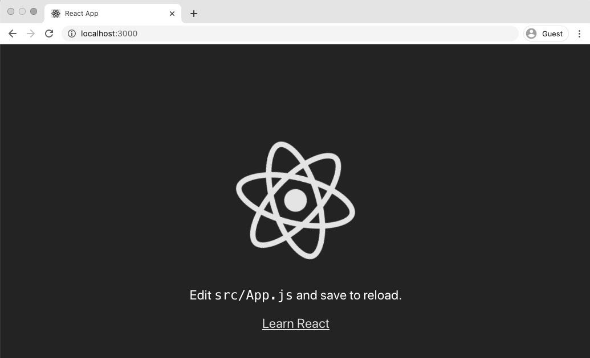
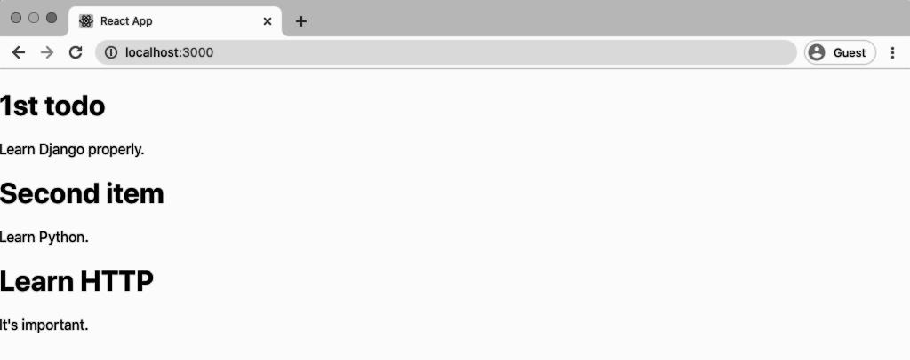

<div dir="rtl">

# فصل 4: Todo React Front-end 

به منظور برقراری ارتباط با برنامه دیگر یک API وجود دارد. در این فصل ما از Todo API فصل قبلی از طریق فرانت اند [React](https://reactjs.org/) استفاده خواهیم کرد. درنتیجه می توانید ببینید که چطور در عمل همه چیز در کنار هم کار می کنند.


 در این جا از React استفاده کرده ام به این دلیل که اخیرا معروف ترین کتابخانه ی فرانت اند جاوااسکریپت می باشد اما تکنولوژی هایی که در اینجا توصیف می شوند با هر فریم ورک معروف فرانت اند دیگری مثل [Vue](https://vuejs.org/), [Angular](https://angular.io/), یا [Ember](https://emberjs.com/) هم کار می کنند. حتی با اپ های موبایلی iOS یا اندروید، اپ های دسکتاپ، یا هر چیز دیگری هم کار می کنند. فرآیند اتصال به یک بکند API به طرز قابل توجهی مشابه است.


اگر درگیر این مسئله شده اید و یا می خواهید بیشتر بدانید که واقعا چه اتفاقی با React می افتد، [official tutorial](https://reactjs.org/tutorial/tutorial.html) که واقعا خوب هستند را بررسی نمایید.
## نصب Node
با پیکره بندی React  به عنوان فرانت اند خودمان شروع می کنیم. در ابتدا یک کنسول خط فرمان (کامند لاین) جدید را باز می کنیم پس حالا **دو کنسول باز هستند**. این مهم هست. چون باید todo بک اندی که در فصل قبل راه اندازی کردیم هم چنان در سرور محلی درحال اجرا باشد. از کنسول دوم نیز برای ساخت و اجرای فرانت اند React روی یک پورت محلی مجزا استفاده خواهیم کرد.
اینگونه ما به تقلید اینکه تنظیمات پروداکشن سفارشی شده و استقرار یافته ی front/back چگونه باشد، می پردازیم.


در خط فرمان جدید دوم [NodeJS](https://nodejs.org/en/) که یک موتور زمان اجرای (ران تایم) جاوااسکریپتی است را نصب می کنیم. این موجب می شود بتوانیم جاوااسکریپت را در محیطی خارج از یک مرورگر وب اجرا نماییم.

روی یک کامپیوتر مک می توانیم از [Homebrew](https://brew.sh/) استفاده کنیم که اگر دستورات [Django for Beginners](https://djangoforbeginners.com/initial-setup/) را برای پیکره بندی کامپیوتر محلی خودتان اجرا کرده باشد، باید نصب باشد.

<div dir="ltr">

خط فرمان

```shell
$ brew install node
```

</div>

روی ویندوز روش های زیادی برای نصب وجود دارد که معروف ترین آن ها استفاده از [nvm-windows](https://github.com/coreybutler/nvm-windows) است که در مخزن گیت آن دستورات نصب کامل و به روزی در این باره وجود دارد.  
  


اگر در محیط لینوکس هستید از [nvm](https://github.com/nvm-sh/nvm) استفاده کنید. تا این لحظه که کتاب نوشته می شود دستور با استفاده از cURL اجرا می گردد. 


<div dir="ltr">

خط فرمان

```shell
$ curl -o- https://raw.githubusercontent.com/nvm-sh/nvm/v0.35.3/\
install.sh | bash
```

</div>


یا از wget  استفاده کنید. 


<div dir="ltr">

خط فرمان

```shell
$ wget -qO- https://raw.githubusercontent.com/nvm-sh/nvm/v0.35.3/\
install.sh | bash
```

</div>

سپس اجرا کنید:

<div dir="ltr">

خط فرمان

```shell
$ command -v nvm
```

</div>

حال کنسول خط فرمان خود را بسته و آن را دوباره باز کنید تا نصب کامل شود.


## نصب React
برای اجرای سریع یک پروژه React جدید از پکیج بسیار خوب [create-react-app](https://github.com/facebookincubator/create-react-app)  استفاده می کنیم. این درواقع دیگ بخار پروژه ما را می سازد و تمامی وابستگی های مورد نیاز پروژه را با یک دستور نصب می کند!


برای نصب react از [npm](https://www.npmjs.com/) استفاده می کنیم. npm ابزار مدیریت پکیج جاوااسکریپت است. npm همانند pipenv در پایتون مدیریت و نصب چندین پکیج نرم افزاری را ساده تر می کند. نسخه های اخیر npm، شامل [npx](https://medium.com/@maybekatz/introducing-npx-an-npm-package-runner-55f7d4bd282b) هم هستند. npx یک روش پیشرفته برای نصب پکیج ها به صورت محلی بدون آلودگی فضای نام سراسری است (polluting the global namespace). این روش پیشنهادی برای نصب React می باشد که ما در این جا از آن استفاده خواهیم کرد.


با ورود به Desktop (اگر روی مک هستید) و سپس فولدر todo از اینکه در مسیر درستی قرار گرفته اید، اطمینان حاصل نمایید.

<div dir="ltr">

خط فرمان

```shell
$ cd ~/Desktop
$ cd todo
```

</div>

یک React App جدید به نام frontend ایجاد کنید.

<div dir="ltr">

خط فرمان

```shell
$ npx create-react-app frontend
```

</div>

حال باید ساختار مسیر شما به صورت زیر باشد.

<div dir="ltr">

دیاگرام

```code
todo
|   ├──frontend
|       ├──React...
|   ├──backend
|       ├──Django...
```

</div>

به پروژه frontend خود برگشته و React App را با دستور npm اجرا می کنیم. 

<div dir="ltr">

خط فرمان

```shell
$ cd frontend
$ npm start
```

</div>

اگر وارد  http://localhost:3000/   شوید صفحه خانه پیشفرض create-react-app را مشاهده خواهید کرد.



## ماک دیتا 

اگر به اندپوینت API بازگردید می توانید فایل خام JSON را در مرورگر به آدرس http://127.0.0.1:8000/api/?format=json  ملاحظه کنید. 

<div dir="ltr">

Code
```json
[
    {
        "id":1,
        "title":"1st todo",
        "body":"Learn Django properly."
    },
    {
        "id":2,
        "title":"Second item",
        "body":"Learn Python."
    },
    {
        "id":3,
        "title":"Learn HTTP",
        "body":"It's important."
    }
]

```

</div>


این مورد زمانی که یک درخواست GET به اندپوینت API صادر شود، برگردانده می شود. در نهایت از API به صورت مستقیم استفاده خواهیم کرد اما یک گام اولیه خوب این است که ابتدا دیتا را ماک کنیم (ایجاد داده های ساختگی) و سپس فرآیند API call را پیکره بندی نماییم.

تنها فایلی که نیاز به بروزرسانی آن در React app هست، فایل `src/App.js`می باشد. در ابتدا API data را در متغیری به نام list که درواقع یک آرایه با 3 مقدار است، ماک می نماییم. 

<div dir="ltr">

کد
```js
// src/App.js
import React, { Component } from 'react';

const list = [
    {
        "id":1,
        "title":"1st todo",
        "body":"Learn Django properly."
    },
    {
        "id":2,
        "title":"Second item",
        "body":"Learn Python."
    },
    {
        "id":3,
        "title":"Learn HTTP",
        "body":"It's important."
    }
]

```

</div>

در مرحله بعدی آرایه list را در state کامپوننت خودمان بارگذاری می کنیم و سپس از متد آرایه ای جاواسکریپت [()map](https://developer.mozilla.org/en-US/docs/Web/JavaScript/Reference/Global_Objects/Array/map)  برای نمایش تمامی آیتم ها استفاده می نماییم.

عمدا سریع از این بخش عبور می کنم، پس اگر قبلا از react استفاده نکرده اید، فقط کد را کپی کنید تا با این کار ببینید که اتصال یک فرانت اند react به بک اند جنگو چگونه انجام می شود. این کد کاملی است که باید آن را در فایل `src/App.js` قرار دهید. 
<div dir="ltr">

کد
```js
// src/App.js
import React, { Component } from 'react';

const list = [
    {
        "id":1,
        "title":"1st todo",
        "body":"Learn Django properly."
    },
    {
        "id":2,
        "title":"Second item",
        "body":"Learn Python."
    },
    {
        "id":3,
        "title":"Learn HTTP",
        "body":"It's important."
    }
]

class App extends Component {
    constructor(props) {
        super(props);
        this.state = { list };
    }
render() {
    return (
        <div>
            {this.state.list.map(item => (
                <div key={item.id}>
                    <h1>{item.title}</h1>
                    <p>{item.body}</p>
                </div>
            ))}
        </div>
        );
    }
}

export default App;

```

</div>

آرایه list را در state اپ کامپوننت مورد نظر بارگذاری نموده ایم، پس از آن از map برای جستجو در هر آیتم از لیستی که `title`و `body`را نشان می دهد استفاده می کنیم. همچنین id را به عنوان کلیدی که یک نیازمندی خاص react می باشد، به این مقادیر اضافه کرده ایم، id به طور خودکار توسط جنگو به هر فیلد دیتابیسی اضافه شده است.
حال باید todo هایمان را که در صفحه اصلی  http://localhost:3000/   لیست شده اند بدون نیاز به رفرش نمودن صفحه ببینید. 



**توجه کنید:** اگر زمانی را صرف کار با react کنید احتمالا جایی این پیغام خطا را مشاهده نمایید:

sh: `react-scripts: command not found while running npm start`.

نگران نباشید. این یک مشکل بسیار بسیار رایج در توسعه جاوااسکریپت است. راه حل معمول این است که دستور `npm install` و پس از آن دوباره `npm start` را اجرا کنید. اگر این راه حل جواب نداد، فولدر `node_modules`را پاک کرده و `npm install` را اجرا کنید. این کار در 99% مواقع مشکل را حل می کند. به توسعه جاوااسکریپت مدرن خوش آمدید :)

## فریم ورک رست Django + React

حال بیایید به جای استفاده از mock data در متغیر list، به طور واقعی به Todo API خودمان متصل شویم. در کنسول خط فرمان دیگر، سرور جنگو در حال اجراست و می دانیم که اندپوینت API که تمامی todo ها را لیست نموده در  http://127.0.0.1:8000/api/ قرار دارد. پس ما باید یک درخواست GET را به آن صادر کنیم.

برای ایجاد درخواست های HTTP دو روش معروف وجود دارد: با استفاده از [built-in Fetch API](https://developer.mozilla.org/en-US/docs/Web/API/Fetch_API)  و یا با استفاده از [axios](https://github.com/axios/axios) که با چندین فیچر اضافی همراه است. در این مثال از axios استفاده خواهیم کرد. React app  که روی خط فرمان در حال اجرا است را با دستور `Control+c` متوقف کنید. سپس `axios` را نصب نمایید.

<div dir="ltr">

خط فرمان

```shell
$ npm install axios
```

</div>

دوباره React app را با دستور npm start راه اندازی کنید.


<div dir="ltr">

خط فرمان

```shell
$ npm start
```

</div>

سپس در ادیتور متنی خود قبل از فایل App.js باید axios  را ایمپورت و فراخوانی کنید.

<div dir="ltr">

کد
```js
// src/App.js
import React, { Component } from 'react';
import axios from 'axios'; // new
...

```

</div>

دو گام باقی مانده است. اول اینکه از axios برای درخواست GET استفاده خواهیم کرد. برای این هدف می توانیم یک تابع getTodos اختصاصی شده بسازیم.

دوم اینکه می خواهیم مطمئن شویم که API call در زمان درستی در طول چرخه حیات React صادر می شود. درخواست های HTTP باید با استفاده از [componentDidMount](https://reactjs.org/docs/state-and-lifecycle.html)   ساخته شوند تا ما getTodos را آن جا فراخوانی کنیم.

از آنجایی که دیگر به mock list نیاز نخواهد شد، می توانیم آن را پاک کنیم. حال فایل کامل `App.js` به صورت زیر خواهد بود:


<div dir="ltr">

کد
```js
// src/App.js
import React, { Component } from 'react';
import axios from 'axios'; // new

class App extends Component {
    state = {
        todos: []
    };

    // new
    componentDidMount() {
    this.getTodos();
    }
    
// new
    getTodos() {
        axios
            .get('http://127.0.0.1:8000/api/')
            .then(res => {
            this.setState({ todos: res.data });
            })
            .catch(err => {
                console.log(err);
        });
    }

    render() {
        return (
            <div>
                {this.state.todos.map(item => (
                    <div key={item.id}>
                        <h1>{item.title}</h1>
                        <span>{item.body}</span>
                    </div>
                ))}
            </div>
            );
        }
    }

export default App;

```

</div>
  
اگر دوباره به http://localhost:3000/ نگاهی بیاندازید می بینید با وجود اینکه دیگر hardcoded data  نداریم اما صفحه تغییری نکرده و همان است. از حالا تمامی این ها از طریق اندپوینت API و درخواست ما می آیند.


حال این روش با react انجام شده است!

## نتیجه گیری

 ما Django backend API خود را به فرانت اند react متصل کرده ایم. حتی بهتر از آن، می توانیم در آینده فرانت خودمان را بروز نماییم یا با تغییر نیازمندی های پروژه آن را کاملا عوض کنیم.

بدین منظور اتخاذ یک روش مبتنی بر API-first بهترین روش برای آینده سایت شماست. ممکن است در ابتدا کار بیشتری برای انجام لازم باشد اما انعطاف پذیری بیشتری فراهم میاورد. در فصل های بعدی API های خود را بهبود خواهیم داد تا درخواست های HTTP بیشتری مثل POST (افزودن todo های جدید)، PUT(به روز رسانی todo های موجود) و DELETE( حذف todo ها) را پشتیبانی نماید.

در فصل بعدی شروع به ساخت یک Blog API مقاوم که تمامی عملیات  CRUD(Create, Read, Update, Delete) را پشتیبانی نماید، خواهیم کرد و پس از آن احراز هویت کاربر را به آن می افزاییم تا کاربران بتوانند از طریق API ما وارد سایت شده، از آن خارج شوند و با حساب کاربری خود ثبت نام نمایند.

</div>
