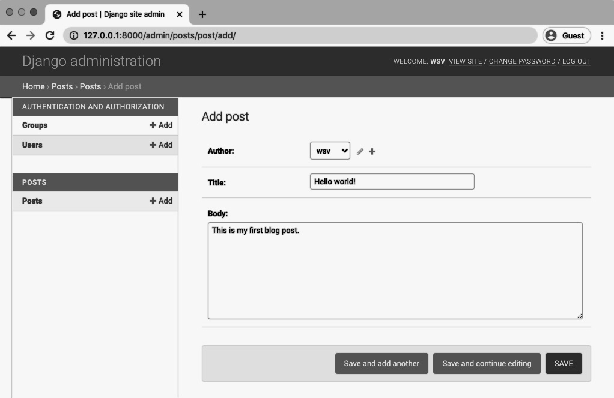
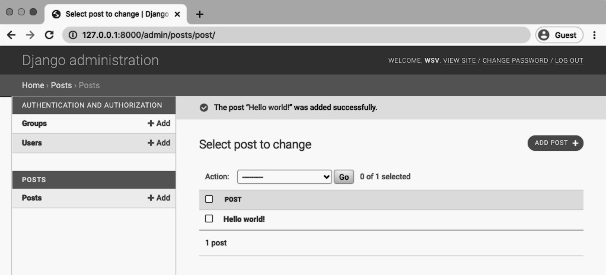
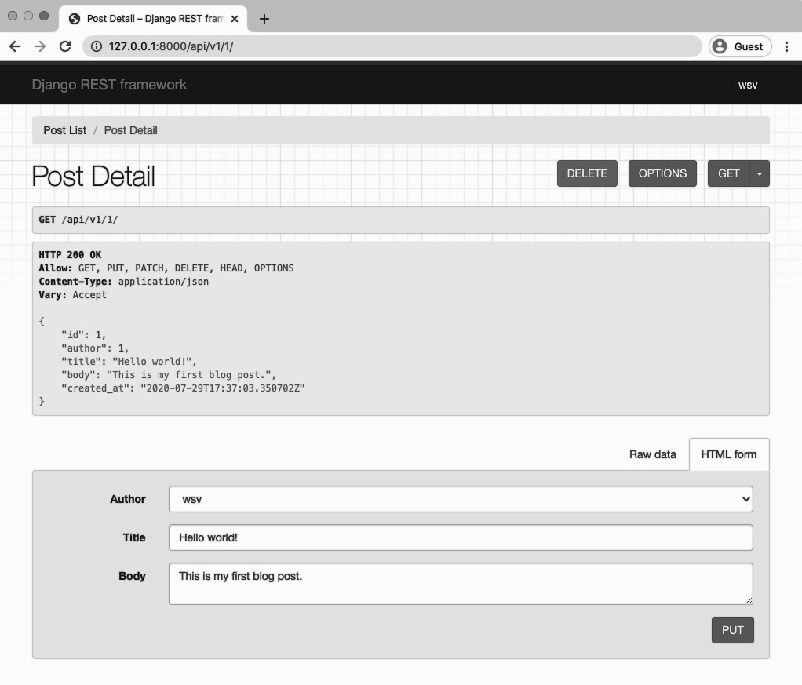
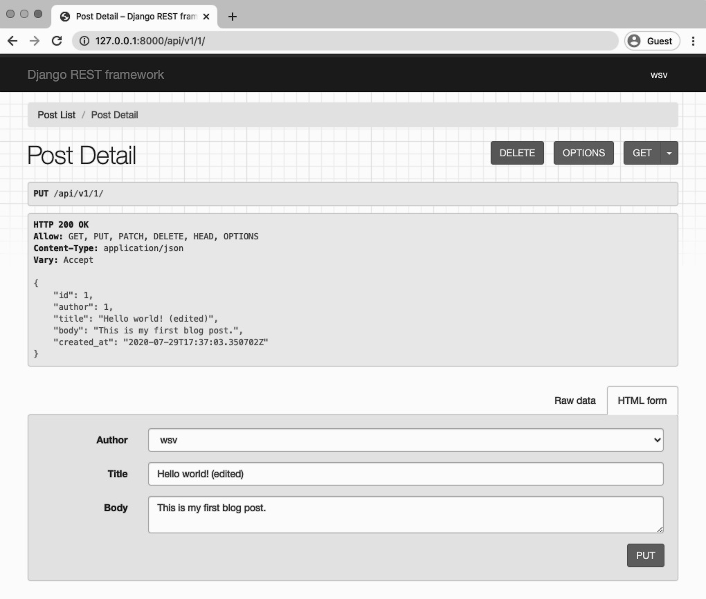
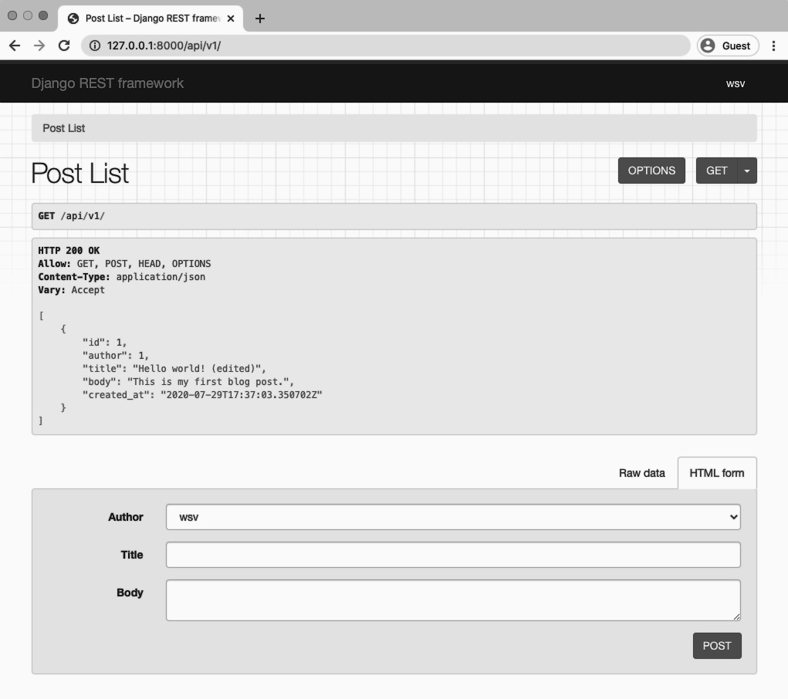

<div dir="rtl">

# فصل 5: ای پی آی وبلاگ
  پروژه بعدی ما یک `Blog API` با استفاده از مجوعه `Django REST Framework` است که شامل کاربران، مجوزها، و امکان استفاده از عملکرد کامل CRUD(ایجاد، خواندن، به روزرسانی، حذف) است. ما همچنین ویوست ها، روترها و اسناد را بررسی خواهیم کرد.
  
  در این بخش ما بخش اصلی API را می سازیم. دقیقا مانند پروژه کتابخانه و TODO API ساخت پروژه را ابتدا با جنگو شروع کرده و سپس آن را به چهارچوب Django Rest Framework اضافه می کنیم.تفاوت اصلی این است که نقاط پایانی API ما از ابتدا از CRUD پشتیبانی می کنند؛ و همانطور که خواهید دید فریم ورک REST جنگو نیز کاملا مشابه همین کار را بدون مشکل انجام میدهد.

### تنظیمات اولیه

تنظیمات اولیه مانند قبل است. در ابتدا به دایرکتوری اصلی پروژه رفته و برنامه ای با نام blogapi می سازیم. سپس جنگو را در محیط مجازی خود نصب میکنیم و یک پیکربندی برای پروژه جدید جنگو خود و برنامه بلاگ برای پست ها انجام می دهیم.

<div dir="ltr">
  
Command Line

```shell
$ cd ~/Desktop && cd code
$ mkdir blogapi && cd blogapi
$ pipenv install django~=3.1.0
$ pipenv shell
(blogapi) $ django-admin startproject config .
(blogapi) $ python manage.py startapp posts
```
  
</div>

هنگامی که برنامه بلاگ را در پروژه ایجاد کردیم باید به جنگو نیز حضور این برنامه را اعلام کنیم. به این منظور برنامه را در قسمت `INSTALLED_APPS` در فایل `config/settings.py` اضافه می کنیم.

<div dir="ltr">
  
Code

```python
# config/settings.py
INSTALLED_APPS = [
    'django.contrib.admin',
    'django.contrib.auth',
    'django.contrib.contenttypes',
    'django.contrib.sessions',
    'django.contrib.messages',
    'django.contrib.staticfiles',
    # Local
    'posts', # new
]

```
  
</div>

اکنون migrate را برای اولین بار اجرا کنید تا پایگاه داده ما با تنظیمات پیش فرض جنگو و برنامه جدید همگام شود.

<div dir="ltr">

Command Line
```shell
(blogapi) $ python manage.py migrate
```
  
</div>

### مدل
مدل پایگاه داده ما دارای پنج فیلد است: نویسنده، عنوان، بدنه، create_at و updated_at. ما می‌توانیم از مدل کاربر داخلی جنگو به‌عنوان کاربر اصلی استفاده کنیم، مشروط بر اینکه آن را در خط دوم کد خود ایمپورت کنیم.

<div dir="ltr">

Code
```python
# posts/models.py
from django.db import models
from django.contrib.auth.models import User
  
  
class Post(models.Model):
    author = models.ForeignKey(User, on_delete=models.CASCADE)
    title = models.CharField(max_length=50)
    body = models.TextField()
    created_at = models.DateTimeField(auto_now_add=True)
    updated_at = models.DateTimeField(auto_now=True)
  
    def __str__(self):
        return self.title
```  
  
</div>  

توجه داشته باشید که ما همچنین در حال تعریف این هستیم که نمایش str مدل باید چگونه باشد که بهترین روش جنگو برای نمایش تیتر پست ها در صفحه ادمین جنگو است.

اکنون پایگاه داده خود را با ایجاد یک فایل migrate جدید و سپس اجرای migrate برای همگام سازی پایگاه داده با تغییرات مدل خود، به روزرسانی کنید.

<div dir="ltr">
  
Command Line
```shell
(blogapi) $ python manage.py makemigrations posts
Migrations for 'posts':
  posts/migrations/0001_initial.py
    - Create model Post
(blogapi) $ python manage.py migrate
Operations to perform:
  Apply all migrations: admin, auth, contenttypes, posts, sessions
Running migrations:
  Applying posts.0001_initial... OK
```

</div>

اکنون میخواهیم داده های خود را در برنامه داخلی ادمین جنگو مشاهده کنیم. برای این منظور ویو را به شکل زیر به فایل posts/admin.py اضافه میکنیم.

<div dir="ltr">

Code
```python
# posts/admin.py
from django.contrib import admin
from .models import Post
  
admin.site.register(Post)
```
  
</div>

در ادامه برای ایجاد یک ابر کاربر برای دسترسی به پنل ادمین دستور زیر را تایپ کرده و ورودی های مورد نظر را به آن می دهیم.

<div dir="ltr">
  
Command Line
```shell
(blogapi) $ python manage.py createsuperuser
```

</div>

حال وب سرور لوکال را با دستور زیر اجرا می کنیم.

<div dir="ltr">
  
Command Line
```shell
(blogapi) $ python manage.py runserver
```

</div>

سپس به آدرس http://127.0.0.1:8000/admin/  رفته و با اطلاعات ابرکاربر خود به داشبورد ادمین وارد می شویم. روی دکمه "+ افزودن" در کنار پست ها کلیک کنید و یک پست وبلاگ جدید ایجاد کنید. در کنار "نویسنده" یک منوی کشویی وجود خواهد داشت که دارای حساب کاربری ابرکاربر شما است (نام کاربر من wsv است). مطمئن شوید که یک نویسنده انتخاب شده باشد.سپس عنوان و محتوای متن را اضافه کنید سپس روی دکمه "ذخیره" کلیک کنید.



در ادامه شما به صفحه ای هدایت می شوید که همه پست های موجود در وبلاگ را نمایش می دهد.



### تست ها
  
Let’s write a basic test for our Post model. We want to ensure a logged-in user can create a blog
post with a title and body.
  
<div dir="ltr">
    
Code
```python
# posts/tests.py
from django.test import TestCase
from django.contrib.auth.models import User
from .models import Post
    
    
class BlogTests(TestCase):
    
    @classmethod
    def setUpTestData(cls):
        # Create a user
        testuser1 = User.objects.create_user(
            username='testuser1', password='abc123')
        testuser1.save()

        # Create a blog post
        test_post = Post.objects.create(
            author=testuser1, title='Blog title', body='Body content...')
        test_post.save()

    def test_blog_content(self):
        post = Post.objects.get(id=1)
        author = f'{post.author}'
        title = f'{post.title}'
        body = f'{post.body}'
        self.assertEqual(author, 'testuser1')
        self.assertEqual(title, 'Blog title')
        self.assertEqual(body, 'Body content...')
```

</div>
  
To confirm that our tests are working quit the local server Control+c. Then run our tests.
    

<div dir="ltr">
  
Command Line
```shell
(blogapi) $ python manage.py test
```

</div>
  
You should see output like the following which confirms everything is working as expected. 
   
<div dir="ltr">
  
Command Line
```shell
(blogapi) $ python manage.py test
Creating test database for alias 'default'...
System check identified no issues (0 silenced).
.
----------------------------------------------------------------------
Ran 1 test in 0.105s
    
OK
Destroying test database for alias 'default'...
```

</div>  
    
    
We are done now with the regular Django part of our API. All we really need is a model and some
data in our database. Now it’s time to add Django REST Framework to take care of transforming
our model data into an API.    
    
    
### Django REST Framework    
    
As we have seen before, `Django REST Framework` takes care of the heavy lifting of transforming
our database models into a RESTful API. There are three main steps to this process:
- `urls.py` file for the URL routes
- `serializers.py` file to transform the data into JSON    
- `views.py` file to apply logic to each API endpoint

    
On the command line use pipenv to install Django REST Framework.
    
<div dir="ltr">
  
Command Line
```shell
(blogapi) $ pipenv install djangorestframework~=3.11.0
```

</div>     

Then add it to the INSTALLED_APPS section of our config/settings.py file. It’s also a good idea
to explicitly set our permissions which by default in Django REST Framework are configured to
AllowAny. We will update these in the next chapter.
    
    
<div dir="ltr">
    
Code
```python
# config/settings.py
INSTALLED_APPS = [
    'django.contrib.admin',
    'django.contrib.auth',
    'django.contrib.contenttypes',
    'django.contrib.sessions',
    'django.contrib.messages',
    'django.contrib.staticfiles',
    
    # 3rd-party apps
    'rest_framework', # new
    
    # Local
    'posts.apps.PostsConfig',
]
    
# new
REST_FRAMEWORK = {
    'DEFAULT_PERMISSION_CLASSES': [
        'rest_framework.permissions.AllowAny',
    ]
}
```

</div>    
    
Now we need to create our URLs, views, and serializers
    
    
### URLs   

Let’s start with the URL routes for the actual location of the endpoints. Update the project-level
`urls.py` file with the include import on the second line and a new api/v1/ route for our posts
app.
 
    
<div dir="ltr">
    
Code
```python
# config/urls.py
from django.contrib import admin
from django.urls import include, path # new
    
    
urlpatterns = [
    path('admin/', admin.site.urls),
    path('api/v1/', include('posts.urls')), # new
]
```

</div>    
    
It is a good practice to always version your APIs—v1/, v2/, etc—since when you make a large
change there may be some lag time before various consumers of the API can also update. That
way you can support a v1 of an API for a period of time while also launching a new, updated v2
and avoid breaking other apps that rely on your API back-end.
    
Note that since our only app at this point is posts we can include it directly here. If we had
multiple apps in a project it might make more sense to create a dedicated api app and then
include all the other API url routes into it. But for basic projects like this one, I prefer to avoid an
api app that is just used for routing. We can always add one later, if needed.
    
Next create our posts app urls.py file.    
    
    
<div dir="ltr">
  
Command Line
```shell
(blogapi) $ touch posts/urls.py
```

</div>   
    
    
And then include the code below    
    
    
<div dir="ltr">
    
Code
```python
# posts/urls.py
from django.urls import path
from .views import PostList, PostDetail
    
    
urlpatterns = [
    path('<int:pk>/', PostDetail.as_view()),
    path('', PostList.as_view()),
]

```

</div>     
    
    
All blog routes will be at api/v1/ so our PostList view (which we’ll write shortly) has the empty
string '' will be at api/v1/ and the PostDetail view (also to be written) at api/v1/# where #
represents the primary key of the entry. For example, the first blog post has a primary id of 1 so
it will be at the route api/v1/1, the second post at api/v1/2, and so on.    
    
    
### Serializers    
    
Now for our serializers. Create a new serializers.py file in our posts app.    
    
<div dir="ltr">
  
Command Line
```shell
(blogapi) $ touch posts/serializers.py    
```

</div>     
    
    
The serializer not only transforms data into JSON, it can also specify which fields to include or
exclude. In our case, we will include the id field Django automatically adds to database models
but we will exclude the `updated_at` field by not including it in our fields.
    
The ability to include/exclude fields in our API this easily is a remarkable feature. More often
than not, an underlying database model will have far more fields than what needs to be exposed.
Django REST Framework’s powerful serializer class makes it extremely straightforward to control
this.    
    
    
<div dir="ltr">
    
Code
```python
# posts/serializers.py
from rest_framework import serializers
from .models import Post
    
    
class PostSerializer(serializers.ModelSerializer):
    
    class Meta:
        fields = ('id', 'author', 'title', 'body', 'created_at',)
        model = Post
```

</div>      
    
At the top of the file we have imported Django REST Framework’s serializers class and our
own models. Then we created a PostSerializer and added a Meta class where we specified
which fields to include and explicitly set the model to use. There are many ways to customize a
serializer but for common use cases, such as a basic blog, this is all we need.
    
    
### Views 
    
The final step is to create our views. Django REST Framework has several generic views that
are helpful. We have already used 
[ListAPIView](https://www.django-rest-framework.org/api-guide/generic-views/#listapiview) in both the Library and Todos APIs to create a
**read-only** endpoint collection, essentially a list of all model instances. In the Todos API we also used 
[RetrieveAPIView](https://www.django-rest-framework.org/api-guide/generic-views/#retrieveapiview) for a **read-only** single endpoint, which is analogous to a detail view in traditional Django.    
    
   
For our Blog API we want to list all available blog posts as a read-write endpoint which means using 
[ListCreateAPIView](https://www.django-rest-framework.org/api-guide/generic-views/#listcreateapiview), which is similar to the ListAPIView we’ve used previously but allows for writes. We also want to make the individual blog posts available to be read, updated, or
deleted. And sure enough, there is a built-in generic Django REST Framework view just for this
purpose: [RetrieveUpdateDestroyAPIView](https://www.django-rest-framework.org/api-guide/generic-views/#retrieveupdatedestroyapiview). That’s what we’ll use here    
    
Update the views.py file as follows. 
    
    
<div dir="ltr">
    
Code
```python
# posts/views.py
from rest_framework import generics
from .models import Post
from .serializers import PostSerializer
    
    
class PostList(generics.ListCreateAPIView):
    queryset = Post.objects.all()
    serializer_class = PostSerializer
    
    
class PostDetail(generics.RetrieveUpdateDestroyAPIView):
    queryset = Post.objects.all()
    serializer_class = PostSerializer
```

</div>   
    
    
At the top of the file we import generics from Django REST Framework as well as our models
and serializers files. Then we create two views. PostList uses the generic `ListCreateAPIView`
while PostDetail uses the `RetrieveUpdateDestroyAPIView`.
    
It’s pretty amazing that all we have to do is update our generic view to radically change the
behavior of a given API endpoint. This is the advantage of using a full-featured framework like
Django REST Framework: all of this functionality is available, tested, and just works. As developers
we do not have to reinvent the wheel here.
    
Phew. Our API is now complete and we really did not have to write much code on our own. We
will make additional improvements to our API in the coming chapters but it is worth appreciating
that it already performs the basic list and CRUD functionality we desire. Time to test things out
with the Django Rest Framework’s browsable API. 
    
    
### Browsable API   
   
Start up the local server to interact with our API.
    
    
<div dir="ltr">
  
Command Line
```shell
(blogapi) $ python manage.py runserver
```

</div> 
    
Then go to http://127.0.0.1:8000/api/v1/ to see the Post List endpoint.


    
The page displays a list of our blog posts—just one at the moment—in JSON format. Note that
both GET and POST methods are allowed.
    
Now let’s confirm that our model instance endpoint—which relates to a single post rather than
a list of all posts—exists.  
 
Go to http://127.0.0.1:8000/api/v1/1/.

   
    
   
You can see in the header that GET, PUT, PATCH, and DELETE are supported but not POST. And in
fact you can use the HTML form below to make changes or even use the red “DELETE” button
to delete the instance.
    
Let’s try things out. Update our title with the additional text (edited) at the end. Then click
on the “PUT” button.
    
  
    
Go back to the Post List view by clicking on the link for it at the top of the page or navigating
directly to http://127.0.0.1:8000/api/v1/ and you can see the updated text there as well.   
    
  
    
 
### Conclusion
    
Our Blog API is completely functional at this point. However there is a big problem: anyone can
update or delete an existing blog post! In other words, we do not have any permissions in place.
In the next chapter we will learn how to apply permissions to protect our API.
    
</div>
