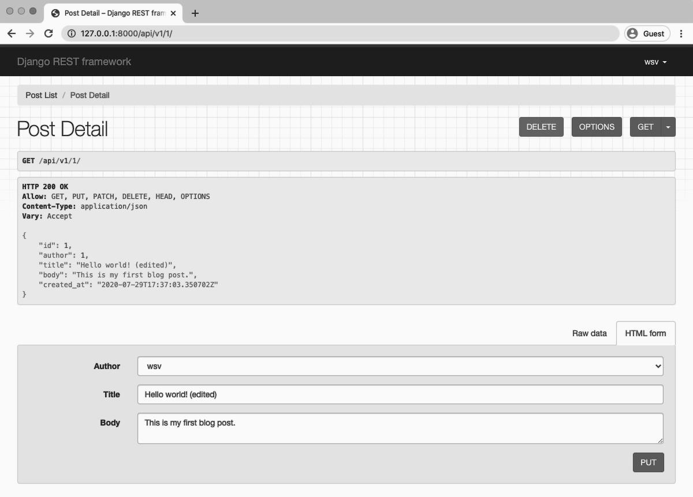
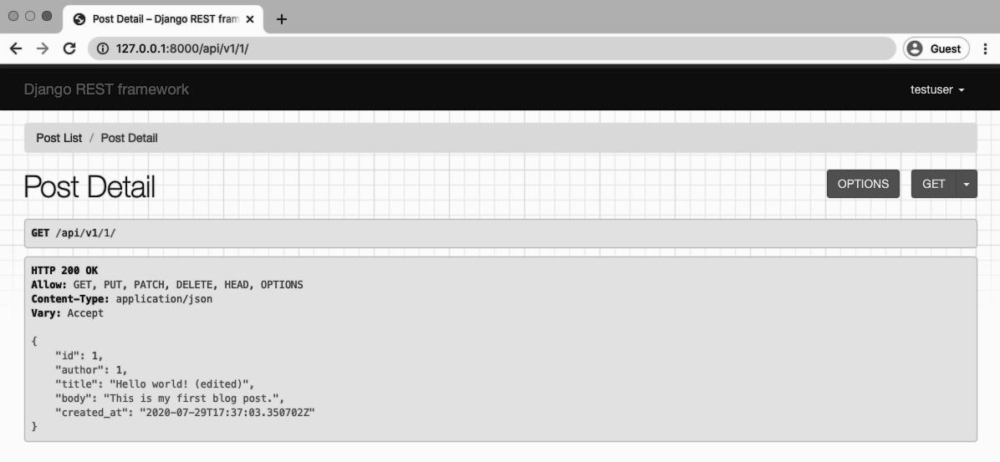

<div dir="rtl">

# Permissions

  
Security is an important part of any website but it is doubly important with web APIs. Currently
our Blog API allows anyone full access. There are no restrictions; any user can do anything which
is extremely dangerous. For example, an anonymous user can create, read, update, or delete any
blog post. Even one they did not create! Clearly we do not want this.
  
`Django REST Framework` ships with several out-of-the-box permissions settings that we can use
to secure our API. These can be applied at a project-level, a view-level, or at any individual model
level.
  
In this chapter we will add a new user and experiment with multiple permissions settings. Then
we’ll create our own custom permission so that only the author of a blog post has the ability to
update or delete it.
  

### Create a new user

  
Let’s start by creating a second user. That way we can switch between the two user accounts to
test our permissions settings.
  
  
Navigate to the admin at `http://127.0.0.1:8000/admin/`. Then click on “+ Add” next to Users.
Enter a username and password for a new user and click on the “Save” button. I’ve chosen the
username testuser here.
  


 
  
The next screen is the Admin User Change page. I’ve called my user testuser and here I could
add additional information included on the default User model such as first name, last name,
email address, etc. But none of that is necessary for our purposes: we just need a username and
password for testing.
  
  


  
Scroll down to the bottom of this page and click the “Save” button. It will redirect back to the
main Users page at http://127.0.0.1:8000/admin/auth/user/.
  
  

  
  
We can see our two users are listed.
  

### Add log in to the browsable API
  
  
Going forward whenever we want to switch between user accounts we’ll need to jump into the
Django admin, log out of one account and log in to another. Each and every time. Then switch
back to our API endpoint.

  
This is such a common occurrence that `Django REST Framework` has a one-line setting to add
log in and log out directly to the browsable API itself. We will implement that now.
  
  
  
Within the project-level `urls.py` file, add a new URL route that includes `rest_framework.urls`.
Somewhat confusingly, the actual route specified can be anything we want; what matters is that
`rest_framework.urls` is included somewhere. We will use the route api-auth since that matches official documentation, 
but we could just as easily use anything-we-want and everything would work just the same.

  
<div dir="ltr">
  
Code
  
```python
# config/urls.py
from django.contrib import admin
from django.urls import include, path

urlpatterns = [
    path('admin/', admin.site.urls),
    path('api/v1/', include('posts.urls')),
    path('api-auth/', include('rest_framework.urls')), # new
]
```
  
  
</div>
  
  
Now navigate to our browsable API at http://127.0.0.1:8000/api/v1/. There is a subtle change:
next to the username in the upper right corner is a little downward-facing arrow.
  
  

  
Since we are logged in with our superuser account at this point—wsv for me—that name appears.
Click on the link and a dropdown menu with “Log out” appears. Click on it.
  
  
The upper righthand link now changes to “Log in.” So go click on that. We are redirected to
`Django REST Framework’s` log in page. Use our testuser account here. It will finally redirect us
back to the main API page where testuser is present in the upper righthand corner.
  
  

  
As a final step, log out of our `testuser` account.
  
  
  

  
You should see the “Log in” link in the upper righthand corner again.
  
  
### AllowAny
  
Currently, any anonymous non-authorized user can access our PostList endpoint. We know this
because even though we are not logged-in, we can see our single blog post. Even worse, anyone
has full access to create, edit, update, or delete a post!
  
  
And on the detail page at http://127.0.0.1:8000/api/v1/1/ the information is also visible and
any random user can update or delete an existing blog post. Not good.
  
  

  
  
The reason we can still see the Post List endpoint and also the Detail List endpoint 
is that we previously set the project-level 
permissions on our project to AllowAny in our `config/settings.py`
file. As a brief reminder, it looked like this:
  
  
  
<div dir="ltr">
  
Code
  
```python
# config/settings.py
REST_FRAMEWORK = {
    'DEFAULT_PERMISSION_CLASSES': [
        'rest_framework.permissions.AllowAny',
    ]
}
```
  
</div>
  
  
  
### View-Level Permissions
  
What we want now is to restrict API access to authenticated users. There are multiple places we
could do this—project-level, view-level, or object-level—but since we only have two views at the
moment let’s start there and add permissions to each of them.

  
In your `posts/views.py` file, import permissions at the top from `Django REST Framework` and
then add a `permission_classes` field to each view.

  
  
<div dir="ltr">
  
Code
  
```python
# posts/views.py
from rest_framework import generics, permissions # new
from .models import Post
from .serializers import PostSerializer
  
  
class PostList(generics.ListCreateAPIView):
    permission_classes = (permissions.IsAuthenticated,) # new
    queryset = Post.objects.all()
    serializer_class = PostSerializer
  
  
class PostDetail(generics.RetrieveUpdateDestroyAPIView):
    permission_classes = (permissions.IsAuthenticated,) # new
    queryset = Post.objects.all()
    serializer_class = PostSerializer

```
  
</div>
  
  
  
That’s all we need. Refresh the browsable API at http://127.0.0.1:8000/api/v1/. Look what
happened!
  
  
  

  
 
We no longer see our Post List page. Instead we are greeted with an unfriendly HTTP 403
Forbidden status code since we are not logged in. And there are no forms in the browsable API
to edit the data since we don’t have permission.
  
  
  
If you use the URL for Post Detail http://127.0.0.1:8000/api/v1/1/ you will see a similar
message and also no available forms for edits.
  
  

  
  
Therefore at this point only logged-in users can view our API. If you log back in with either your
superuser or testuser account the API endpoints will be accessible.

  
  
But think about what happens as the API grows in complexity. It’s likely we will have many more views and endpoints in the future. 
Adding a dedicated `permission_classes` to each view seems repetitive if we want to set the same permissions setting across our entire API
  
  
Wouldn’t it be better to change our permissions once, ideally at the project-level, rather than
doing it for each and every view?
  
  
### Project-Level Permissions

 
You should be nodding your head yes at this point. It is a much simpler and safer approach to
set a strict permissions policy at the project-level and loosen it as needed at the view level. This
is what we will do.

 
Fortunately `Django REST Framework` ships with a number of built-in project-level permissions
settings we can use, including:
  
- [AllowAny](http://www.django-rest-framework.org/api-guide/permissions/#allowany) - any user, authenticated or not, has full access
- [IsAuthenticated](http://www.django-rest-framework.org/api-guide/permissions/#isauthenticated) - only authenticated, registered users have access
- [IsAdminUser](http://www.django-rest-framework.org/api-guide/permissions/#isadminuser) - only admins/superusers have access
- [IsAuthenticatedOrReadOnly](http://www.django-rest-framework.org/api-guide/permissions/#isauthenticatedorreadonly) - 
  unauthorized users can view any page, but only authenticated users have write, edit, or delete privileges   
  
Implementing any of these four settings requires updating the `DEFAULT_PERMISSION_CLASSES`
setting and refreshing our web browser. That’s it!

  
Let’s switch to IsAuthenticated so only authenticated, or logged in, users can view the API.
Update the config/settings.py file as follows:
  
  
<div dir="ltr">
  
Code
  
```python
# config/settings.py
REST_FRAMEWORK = {
    'DEFAULT_PERMISSION_CLASSES': [
        'rest_framework.permissions.IsAuthenticated', # new
    ]
}
```
  
</div>


Now go back into the posts/views.py file and delete the permissions changes we just made.
  
  
  
<div dir="ltr">
  
Code
  
```python
# posts/views.py
from rest_framework import generics
from .models import Post
from .serializers import PostSerializer
  
  
class PostList(generics.ListCreateAPIView):
    queryset = Post.objects.all()
    serializer_class = PostSerializer
  
  
class PostDetail(generics.RetrieveUpdateDestroyAPIView):
    queryset = Post.objects.all()
    serializer_class = PostSerializer
```
  
</div>
  
  
If you refresh the Post List and Detail List API pages you will still see the same 403 status code.
We have now required all users to authenticate before they can access the API, but we can always
make additional view-level changes as needed, too.
  
  
  
### Custom permissions
  
  
Time for our first custom permission. As a brief recap of where we are now: we have two users,
testuser and the superuser account. There is one blog post in our database, which was created
by the superuser.
  
We want only the author of a specific blog post to be able to edit or delete it; otherwise the
blog post should be read-only. So the superuser account should have full CRUD access to the
individual blog instance, but the regular user testuser should not.
  
  
Stop the local server with Control+c and create a new permissions.py file in our posts app.
  

<div dir="ltr">

Command Line  
  
```shell
(blogapi) $ touch posts/permissions.py
```  
  
</div>
  
  
Internally, `Django REST Framework` relies on a BasePermission class from which all other permission classes inherit. 
That means the built-in permissions settings like `AllowAny`, `IsAuthenticated`,
and others extend it. Here is the actual source code which is [available on Github](https://github.com/encode/django-rest-framework):
  

<div dir="ltr">
  
Code
  
```python
class BasePermission(object):
    """
    A base class from which all permission classes should inherit.
    """
  
    def has_permission(self, request, view):
        """
        Return `True` if permission is granted, `False` otherwise.
        """
        return True
  
    def has_object_permission(self, request, view, obj):
        """
        Return `True` if permission is granted, `False` otherwise.
        """
        return True
```
  
</div>
  
To create our own custom permission, we will override the `has_object_permission` method.
Specifically we want to allow read-only for all requests but for any write requests, such as edit
or delete, the author must be the same as the current logged-in user.
  
Here is what our `posts/permissions.py` file looks like.
  
<div dir="ltr">
  
Code
  
```python
# posts/permissions.py
from rest_framework import permissions
  
  
class IsAuthorOrReadOnly(permissions.BasePermission):
  
def has_object_permission(self, request, view, obj):
    # Read-only permissions are allowed for any request
    if request.method in permissions.SAFE_METHODS:
        return True
  
    # Write permissions are only allowed to the author of a post
    return obj.author == request.user
```
  
</div>
  
  
We import `permissions` at the top and then create a custom class `IsAuthorOrReadOnly` which
extends BasePermission. Then we override has_object_permission. If a request contains HTTP
verbs included in SAFE_METHODS–a tuple containing GET, OPTIONS, and HEAD–then it is a read-only
request and permission is granted.
  
  
Otherwise the request is for a write of some kind, which means updating the API resource so
either create, delete, or edit functionality. In that case, we check if the author of the object in
question, which is our blog post `obj.author` matches the user making the request `request.user`.
  
  
Back in the `views.py` file we should import `IsAuthorOrReadOnly` and then we can add permission_classes for PostDetail.
  
  
<div dir="ltr">
  
Code
  
```python
# posts/views.py
from rest_framework import generics
from .models import Post
from .permissions import IsAuthorOrReadOnly # new
from .serializers import PostSerializer
  
  
class PostList(generics.ListCreateAPIView):
    queryset = Post.objects.all()
    serializer_class = PostSerializer
  
  
class PostDetail(generics.RetrieveUpdateDestroyAPIView):
    permission_classes = (IsAuthorOrReadOnly,) # new
    queryset = Post.objects.all()
    serializer_class = PostSerializer
```
  
</div>
  
  
And we’re done. Let’s test things out. Navigate to the Post Detail page, which is located at
http://127.0.0.1:8000/api/v1/1/. Make sure you are logged-in with your superuser account,
who is the author of the post. The username should be visible in the upper righthand corner of the page
  


  
 
However, if you log out and then log in with the testuser account, the page changes.
  
  

  
  
We **can** view this page since read-only permissions are allowed. However we **can not** make any
PUT or DELETE requests due to our custom IsAuthorOrReadOnly permission class.
  
 
Note that the generic views will only check the object-level permissions for views that retrieve
a single model instance. If you require object-level filtering of list views–for a collection of
instances–you’ll need to filter by [overriding the initial queryset](https://www.django-rest-framework.org/api-guide/filtering/#overriding-the-initial-queryset) .
  
    
### Conclusion  

Setting proper permissions is a very important part of any API. As a general strategy, it is a good
idea to set a strict project-level permissions policy such that only authenticated users can view
the API. Then make view-level or custom permissions more accessible as needed on specific API
endpoints.
  
</div>
