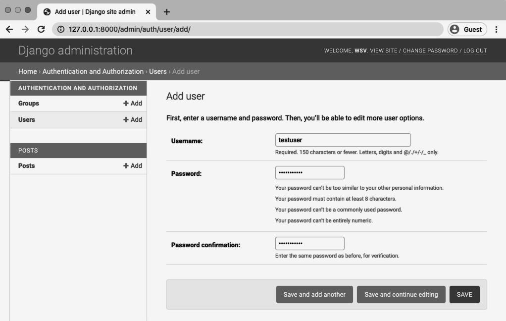
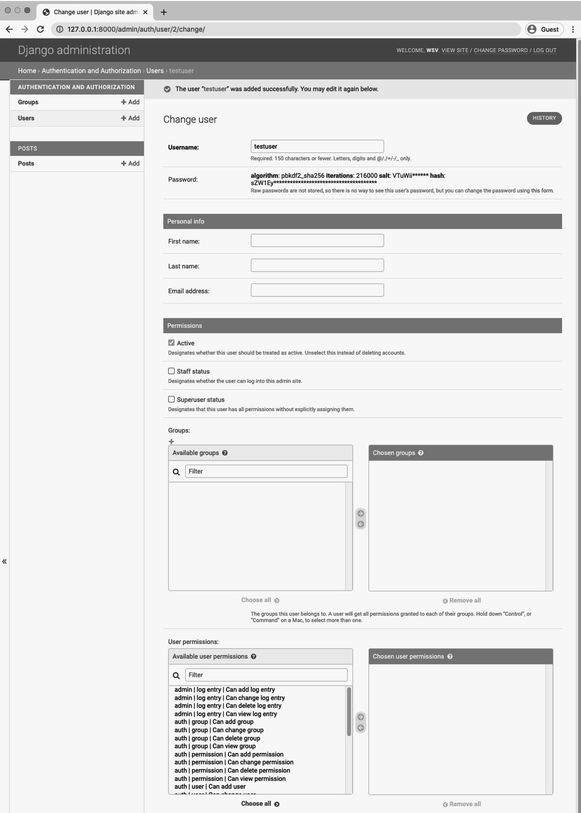
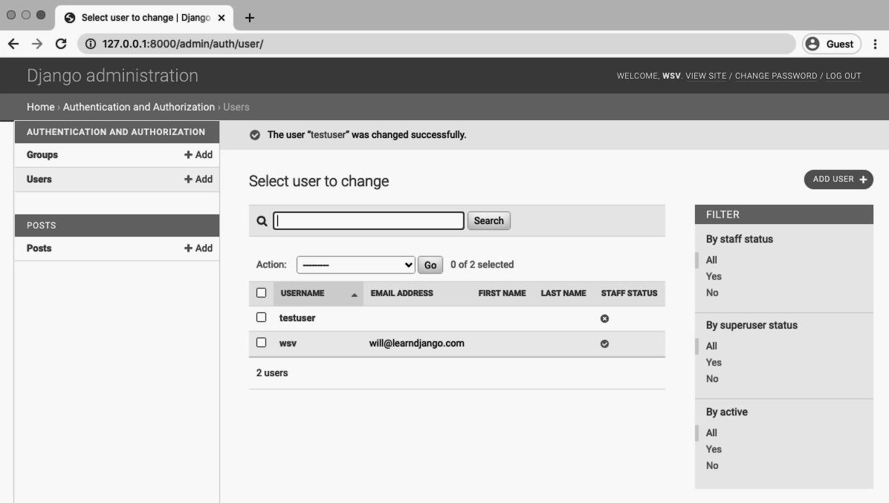
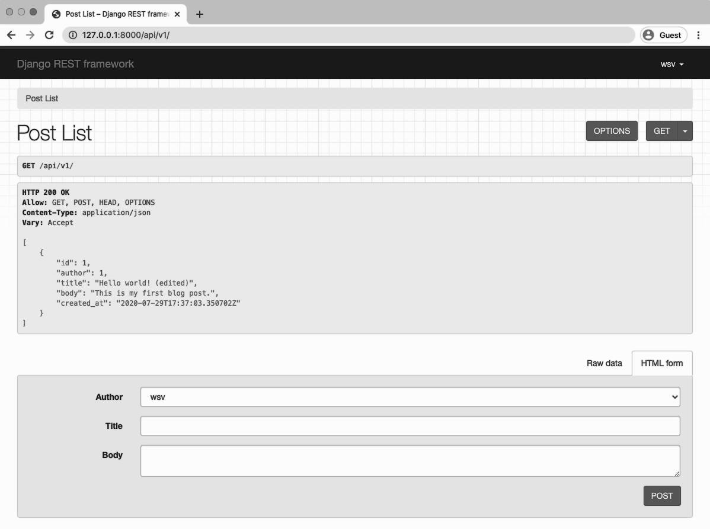
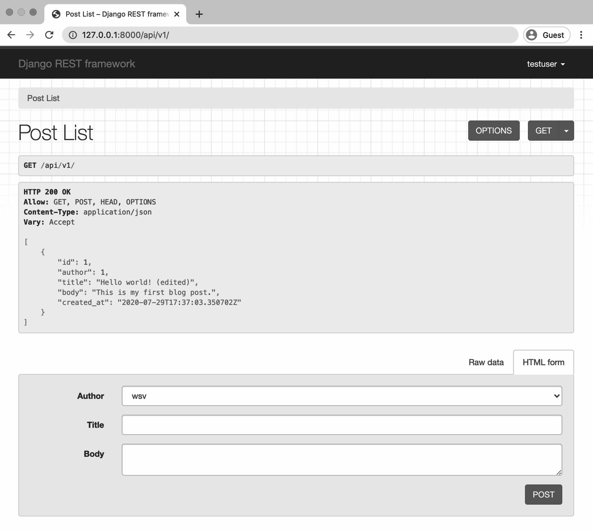
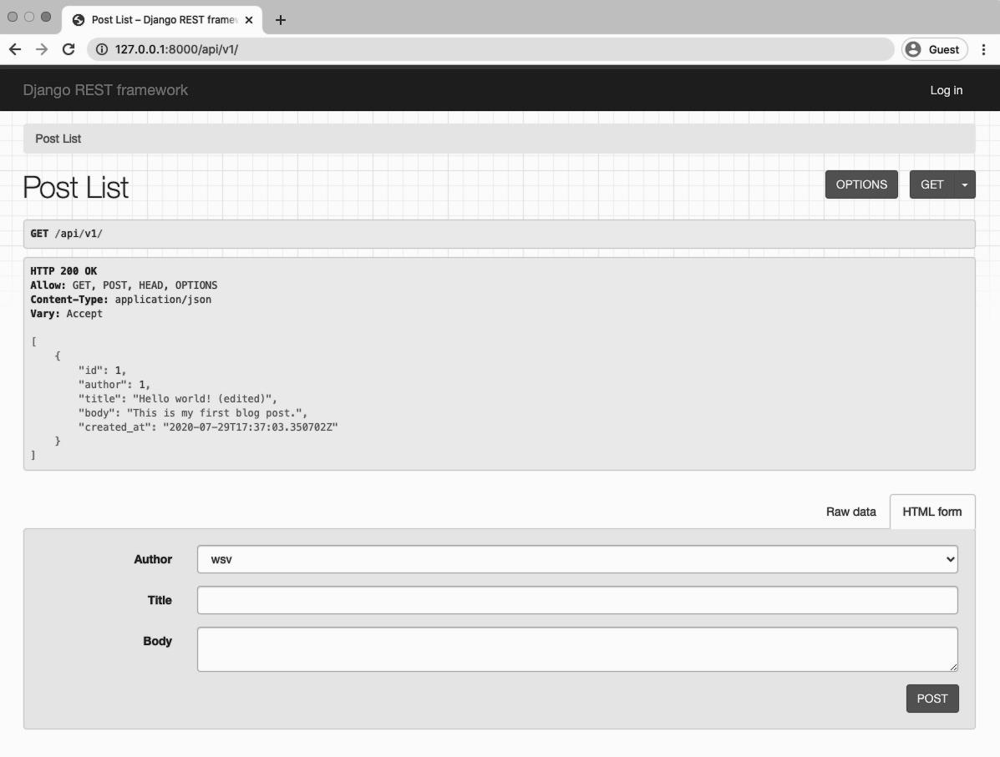
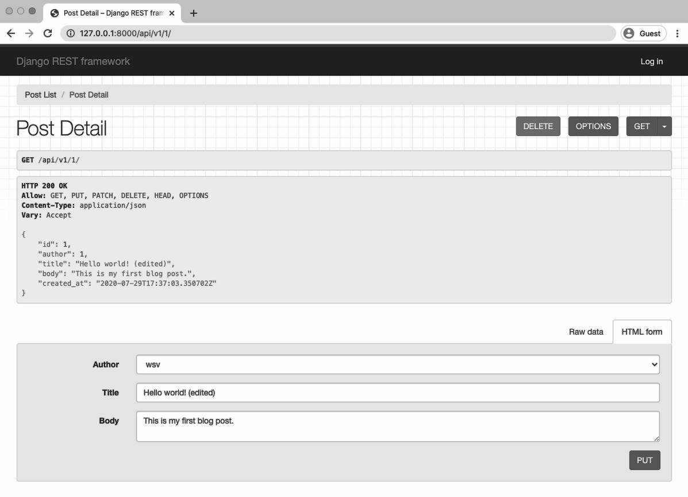
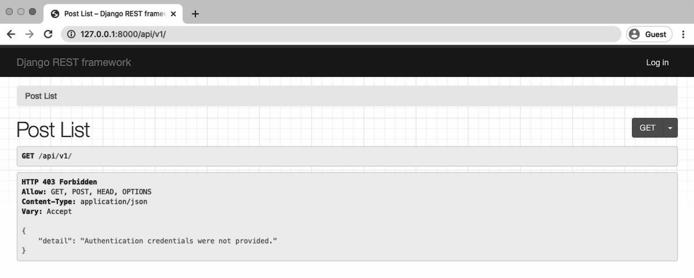
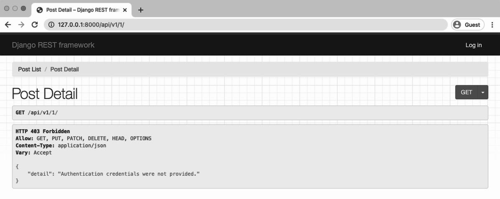

<div dir="ltr">
  
# مجوزها    
  
امنیت بخش مهمی از هر وب‌سایت است اما با API ها دو چندان می‌شود.در حال حاضر API ما اجازه دسترسی کامل به هر شخصی را می‌دهد. هیچ محدودیتی وجود ندارد و هر کاربری هر کاری می‌تواند انجام دهد که بسیار خطرناک است.به عنوان مثال، یک کاربر ناشناس می‌تواند پستی را ایجاد کند، بخواند، تغییر دهد یا حذف کند. حتی آن پستی که خودش ایجاد نکرده‌است.مشخصاً ما چنین چیزی را نمی‌خواهیم.


البته `Django REST Framework` با تنظیمات ساده‌ي مجوزها همراه می‌باشد که ما می‌توانیم از آنها برای ایمن کردن API استفاده کنیم.
این تنظیمات را می‌توان در سطح پروژه، در سطح نما یا در سطح هر مدل اعمال کرد.
  
در این فصل ابتدا یک کاربر جدید اضافه می‌کنیم و تنظیمات چندین مجوز را آزمایش می‌کنیم. سپس مجوز شخصی‌سازی شده‌ی خودمان را طوری ایجاد می‌کنیم که تنها نویسنده آن پست بتواند آن‌را بروزرسانی یا حذف کند.
  
 ### ایجاد کاربر جدید
 بیایید با ایجاد کاربر دوم شروع کنیم. با این کار می‌توانیم بین اکانت‌های این دو کاربر جابجا شویم تا تنظیمات مجوزها را آزمایش کنیم.
 
به پنل ادمین در `/http://127.0.0.1:8000/admin` بروید.سپس روی “+ Add” کنار Users کلیک کنید. نام‌کاربری و پسورد را برای کاربر جدید وارد کنید و سپس بر روی دکمه‌ی 'Save' کلیک کنید. من در اینجا نام‌کاربری را testuser انتخاب کرده‌ام.
  


تصویر بعدی صفحه‌ی ادمین برای تغییر کاربرها می‌باشد. من کاربر خود را testuser  انتخاب کرده‌ام و در اینجا می‌توانم اطلاعات بیشتری را نظیر نام، نام‌خانوادگی، آدرس ایمیل، آدرس و ...به مدل کاربر اضافه کنم. اما هیچکدام از آنها برای مقصود ما مهم نیستند: ما فقط به نام‌کاربری و پسورد برای آزمایش نیاز داریم. 
  


به پایین این صفحه رفته و روی دکمه‌ی 'Save' کلیک کنید. که به صفحه اصلی کاربران در .
/http://127.0.0.1:8000/admin/auth/user
هدایت می‌کند.
  
 
  
 همانطور که می‌بینید دو کاربر ما حضور دارند.
  
 ### اضافه کردن قابلیت ورود به API قابل مرور
 
 هر بار که بخواهیم بین دو کاربر جابجا شویم باید به پنل ادمین جنگو رفته و از آن حساب خارج شده و به دیگری لاگین کنیم. سپس به API موردنظر برویم.
 
این اتفاق معمولی هست که`Django REST Framework`  تنظیمی یک خطی برای اضافه  کردن قابلیت وارد و خارج شدن کاربر به صورت مستقیم به API قابل جستجو دارد. که ما آن‌ را پیاده‌سازی می‌کنیم.
 
در مسیر پروژه داخل فایل `urls.py`، یک مسیر که شامل `rest_framework.urls` می‌باشد را به URLها اضافه کنید. تا حدودی گیج کننده‌است، مسیرواقعی مشخص شده می‌تواند هر چیزی که ما می‌خواهیم باشد. چیزی که مهم است `rest_framework.urls` یک جایی قرار دارد. ما از مسیر   api-auth بخاطر این که که با مستندات مطابقت دارد استفاده می‌کنیم، اما ما هر چیزی را می‌توانستیم استفاده کنیم و همه آنها نیز شبیه به هم عمل می‌کردند.  
   
 
کد
  
 ```
  # config/urls.py
from django.contrib import admin
from django.urls import include, path

urlpatterns = [
    path('admin/', admin.site.urls),
    path('api/v1/', include('posts.urls')),
    path('api-auth/', include('rest_framework.urls')), # new
]
```
حال به مسیر API قابل مرور در /http://127.0.0.1:8000/api/v1   یک تغییر کوچک بوجود آمده‌است: که یک فلش رو به پایین در کنار نام‌کاربری در گوشه بالا سمت راست ظاهر شده‌است.روی آن کلیک کنید. 
  

  
 از آنجایی که ما به عنوان کاربر اصلی وارد شده‌ایم در اینجا برای من WSV نمایان شده‌است. بر روی لینک کلیک کنید و یک منو کشویی برای خارج شدن(Logout)ظاهر می‌شود. روی آن کلیک کنید.   

لینک بالا در سمت راست حالا به لاگین(login) تغییر پیدا کرده‌است. روی آن کلیک کنید. به صفحه لاگین `Django Rest Framework` هدایت می‌شویم. در اینجا از اکانت آزمایشی استفاده می‌کنیم. در نهایت به صفحه اصلی API جایی که کاربر آزمایشی در سمت راست و بالا نمایان می‌باشد، هدایت می‌شویم.
  

  
به عنوان قدم آخر از حساب آزمایشی خود خارج شوید.

  


باید لینک لاگین را دوباره در سمت راست بالا  ببینید.  
 
### مجوز برای همه
  
در حال حاضر، هر کاربر ناشناس احراز هویت نشده می‌تواند به لیست پست‌ها دسترسی داشته باشد. ما این را می‌دانیم زیرا اگرچه لاگین نکرده‌ایم، می‌توانیم تنها پستمان را مشاهده کنیم. حتی بدتر، هر کسی می‌تواند دسترسی کامل برای ایجاد پست،،بروزرسانی آنها و یا حذف آنها داشته باشد.
  
 صفحه جزئیات در آدرس /http://127.0.0.1:8000/api/v1/1 اطلاعات قابل مشاهده می‌باشد و هر کاربر تصادفی می‌تواند پستی را در صورت وجود بروزرسانی یا حذف کند. که خوب نیست.
  

  
دلیلی که ما هنوز می‌توانیم پست‌ها و جزئیات آنها را مشاهده کنیم این هست که ما تنظیمات مجوزها را در فایل `config/settings.py` روی AllowAny قرار داده‌ایم.
به عنوان یک یادآوری کوچک، به شکل زیر می‌باشد:  
<div dir="ltr">
  
کد

```python
# config/settings.py
REST_FRAMEWORK = {
    'DEFAULT_PERMISSION_CLASSES': [
        'rest_framework.permissions.AllowAny',
    ]
}
```
</div>

### مجوز در سطح نما
  
آنچه اکنون می‌خواهیم این است که دسترسی کاربران را به API محدود کنیم. چندین روش برای این منظور وجود دارد :در سطح پروژه، در سطح نما(view) یا در سطح شیء اما از آنجایی که ما فقط دو نما داریم پس بیایید از آنجا شروع کنیم و برای هر کدام مجوز تعیین کنیم.
  
در فایل `posts/views.py`،ماژول permissions را وارد کنید و سپس به هر فیلد `permisson_classes` را اضافه کنید.
  
کد

```
# posts/views.py
from rest_framework import generics, permissions # new
from .models import Post
from .serializers import PostSerializer
  
  
class PostList(generics.ListCreateAPIView):
    permission_classes = (permissions.IsAuthenticated,) # new
    queryset = Post.objects.all()
    serializer_class = PostSerializer
  
  
class PostDetail(generics.RetrieveUpdateDestroyAPIView):
    permission_classes = (permissions.IsAuthenticated,) # new
    queryset = Post.objects.all()
    serializer_class = PostSerializer  
```
این تمام چیزی بود که نیاز داشتیم. صفحه را در /http://127.0.0.1:8000/api/v1 رفرش کنید. ببینید چه اتفاقی افتاد!


  
ما دیگر نمی‌توانیم لیست پست‌ها را ببینیم. در عوض با پیام HTTP 403 که کد وضعیت ممنوع می‌باشد زیرا ما لاگین نشده‌ایم. و از آنجایی که مجوز نداریم هیچ فرمی در API برای ویرایش داده‌ها وجود ندارد.
  
اگر به مسیر جزئیات پست درhttp://127.0.0.1:8000/api/v1/ بروید پیامی مشابه را خواهید دید و همچنین  فرمی برای ویرایش وجود ندارد.
  
  
  
بنابراین از این لحظه تنها کاربران لاگین شده می‌توانند صفحه API را ببینند. اگر با حساب testuser‌ یا superuser خود وارد شوید این صفحات در دسترس هستند.
  
اما به این فکر کنید که اگر API از نظر پیچیدگی گسترده‌تر شود. در واقع ما در نماها و صفحات بیشتری را در آینده خواهیم داشت. که اضافه کردن `permission_classes`اختصاصی برای هر نما اگر بخواهیم از تنظیمات مجوز مشابه در تمام API استفاده کنیم کاری تکراری  به نظر می‌آید.
  
آیا بهتر نیست که مجوزها را یکبار برای همیشه، برای سطح پروژه   انجام دهیم، تا اینکه به ازای هر نما اینکار را انجام دهیم؟
  
  

</div> 
