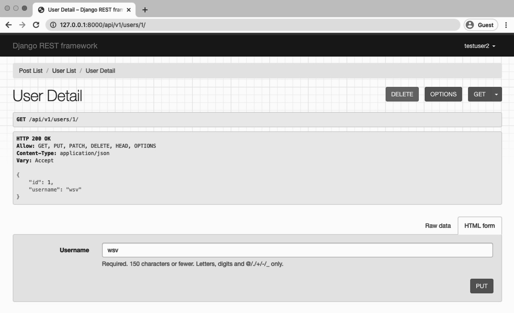
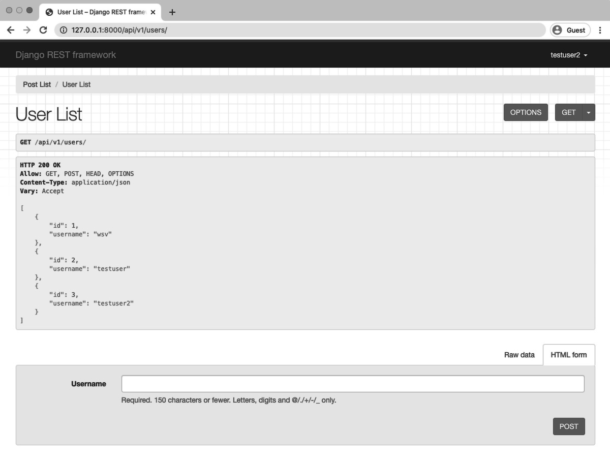
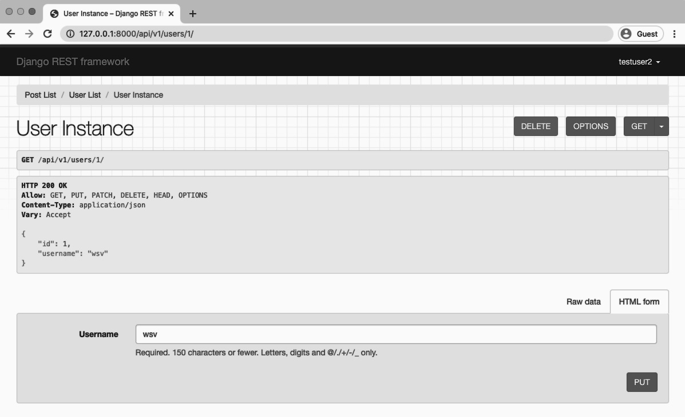
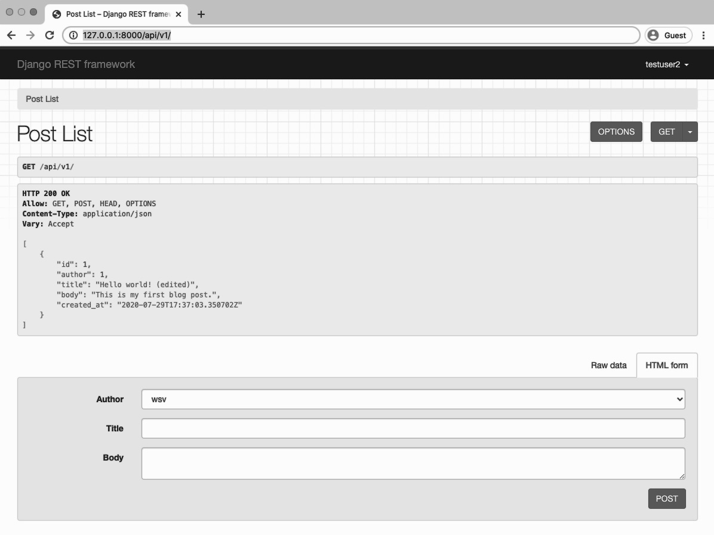
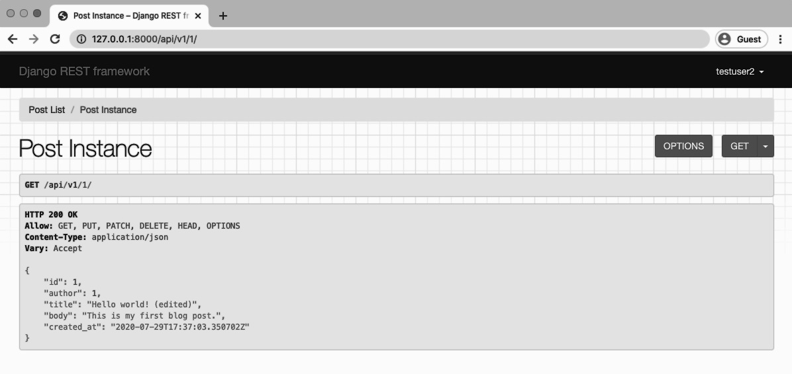
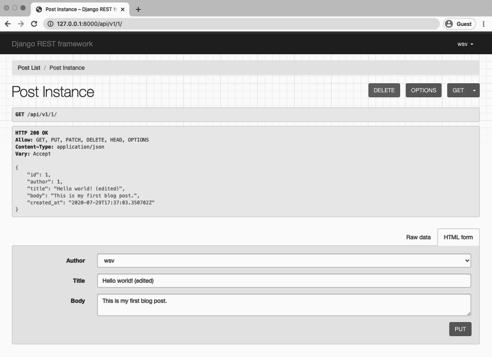

<div dir="rtl">


# ویوست و روتر ها Viewsets and Routers 

[ویوست ها (Viewsets)](https://www.django-rest-framework.org/api-guide/viewsets/) و [روتر ها routers](https://www.django-rest-framework.org/api-guide/routers/) 
ابزارهایی در Django REST Framework هستند که می توانند سرعت توسعه API را افزایش دهند.
آنها یک لایه اضافی از انتزاع در بالای ویوها و URL ها هستند. مزیت اصلی, این است که یک viewset می تواند جایگزین چندین view مرتبط شود. 
و یک router میتواند به طور خودکار url برای توسعه دهنده ایجاد کند. در پروژه های بزرگتر با endpoint زیاد، این بدان معناست که یک توسعه دهنده باید کد کمتری بنویسد.
همچنین, مسلماً برای یک توسعه دهنده با تجربه, درک و استدلال در مورد تعداد کمی از viewset و ترکیبات router آسان تر از یک لیست طولانی از view ها و URL ها است.  

 
در این فصل ما دو API endpoint جدید را به پروژه فعلی خود اضافه خواهیم کرد و خواهیم دید که چگونه تغییر از
view ها و URL ها به viewset ها و router ها می تواند به همان عملکرد با کد بسیار کمتر دست یافت.
  
  

### اندپوینت های کاربر User endpoints
  
در حال حاضر ما API endpoit های زیر را در پروژه خود داریم. همه آنها با پیشوند `api/v1/` هستند که برای اختصار نشان داده نشده است:

<div dir="ltr">
    
Diagram
```code
|Endpoint                              |HTTP Verb|
|--------------------------------------|---------|
|/                                     |GET      |
|/:pk/                                 |GET      |
|/rest-auth/registration               |POST     |
|/rest-auth/login                      |POST     |
|/rest-auth/logout                     |GET      |
|/rest-auth/password/reset             |POST     |
|/rest-auth/password/reset/confirm     |POST     |

```

</div>


دو endpoint توسط ما ایجاد شد در حالی که dj-rest-auth پنج تای دیگر را ارائه می دهد . بیاید اکنون
دو endpoint دیگر برای فهرست کردن همه و تک تک کاربران اضافه کنیم . این یک ویژگی مشترک در بسیاری
از api ها است که واضح تر می کند view ها و URL ها به viewset ها و router ها می تواند منطقی باشد.

جنگو یک مدل کلاس کاربر داخلی (User) مرسوم دارد که در فصل قبل برای احراز هویت از آن استفاده کرده ایم. 
بنابراین نیازی به ایجاد مدل جدید در دیتابیس نداریم.
در عوض ما فقط باید endpoint های جدید را سیم کشی کنیم . این فرآیند همیشه شامل سه مرحله زیر است:

- کلاس serializer جدید برای مدل
- view های جدید برای هر endpoint
- مسیرهای URL جدید برای هر endpoint

با serializer شروع کنید. ما نیاز داریم مدل User را import کنیم و یک کلاس UserSerializer
ایجاد کنیم که از آن استفاده کند. سپس آن را به فایل `posts/serializers.py` موجود خود اضافه می کنیم.

    
<div dir="ltr">
    
code
```python
# posts/serializers.py
from django.contrib.auth import get_user_model # new
from rest_framework import serializers
from .models import Post


class PostSerializer(serializers.ModelSerializer):
    class Meta:
        model = Post
        fields = ('id', 'author', 'title', 'body', 'created_at',)


class UserSerializer(serializers.ModelSerializer): # new
    class Meta:
      model = get_user_model()
      fields = ('id', 'username',)
```

</div>
    
 
شایان ذکر است که در حالی که ما از get_user_model برای ارجاع به مدل User در اینجا استفاده کرده ایم ,
در واقع [سه راه مختلف برای ارجاع](https://docs.djangoproject.com/en/3.1/topics/auth/customizing/#referencing-the-user-model) 
به مدل User در جنگو وجود دارد.

با استفاده از get_user_model اطمینان حاصل می کنیم که به مدل User صحیح اشاره می کنیم,
چه User پیش فرض باشد یا یک مدل [User سفارشی](https://docs.djangoproject.com/en/3.1/topics/auth/customizing/#specifying-a-custom-user-model)
همانطور که اغلب در پروژه های جنگو جدید تعریف می شود.
 
 

 
 
در ادامه باید برای هر endpoint نماها(views) را تعریف کنیم. ابتدا `UserSerializer` را به لیست import ها اضافه کنید.
سپس هم یک کلاس UserList ایجاد کنید که همه
کاربران را فهرست می کند و هم یک کلاس UserDetails که نمای جزئیات یک کاربر را ارائه می دهد.
درست مانند view های پست خود، می توانیم از `ListCreateAPIView` و `RetrieveUpdateDestroyAPIView` در اینجا استفاده کنیم. ما همچنین نیاز به ارجاع به
مدل کاربران از طریق get_user_model داریم بنابراین در خط بالا import می شود.

 
<div dir="ltr">
    
    
code
```python
# posts/views.py
from django.contrib.auth import get_user_model # new
from rest_framework import generics
from .models import Post
from .permissions import IsAuthorOrReadOnly
from .serializers import PostSerializer, UserSerializer # new


class PostList(generics.ListCreateAPIView):
    queryset = Post.objects.all()
    serializer_class = PostSerializer


class PostDetail(generics.RetrieveUpdateDestroyAPIView):
    permission_classes = (IsAuthorOrReadOnly,)
    queryset = Post.objects.all()
    serializer_class = PostSerializer


class UserList(generics.ListCreateAPIView): # new
    queryset = get_user_model().objects.all()
    serializer_class = UserSerializer


class UserDetail(generics.RetrieveUpdateDestroyAPIView): # new
    queryset = get_user_model().objects.all()
    serializer_class = UserSerializer

```

</div>

اگر متوجه شده باشید، در اینجا کمی تکرار وجود دارد. هم view های پست و هم view های کاربر queryset و serializer_class 
یکسانی دارند. شاید بتوان این را به نوعی برای ذخیره کد ترکیب کرد؟

در نهایت ما مسیرهای URL خود را داریم. اطمینان حاصل کنید که view های UserList و UserDetail را import کرده اید.
سپس می توانیم از پیشوند users/ برای هر کدام استفاده کنیم.


<div dir="ltr">
    
code
```python
# posts/urls.py
from django.urls import path
from .views import UserList, UserDetail, PostList, PostDetail # new


urlpatterns = [
    path('users/', UserList.as_view()), # new
    path('users/<int:pk>/', UserDetail.as_view()), # new
    path('', PostList.as_view()),
    path('<int:pk>/', PostDetail.as_view()),
]

```

</div>

و ما تمام کردیم. اطمینان حاصل کنید که سرور محلی همچنان در حال اجرا است و به 
API قابل مرور (browsable API) بروید تا تأیید کنید همه چیز همانطور که انتظار می رود کار می کند.

لیست endpoint کاربران ما در http://127.0.0.1:8000/api/v1/users/ قرار دارد.


کد وضعیت (status code) برابر 200 OK است که به این معنی است که همه چیز کار می کند. ما می توانیم سه کاربر موجود خود را ببینیم.
 
نقطه پایانی (endpint) جزئیات کاربر در کلید اصلی برای هر کاربر در دسترس است. بنابراین حساب کاربری superuser
ما در آدرس زیر قرار دارد: http://127.0.0.1:8000/api/v1/users/1/.
 



### Viewsets

A viewset is a way to combine the logic for multiple related views into a single class. In other
words, one viewset can replace multiple views. Currently we have four views: two for blog posts
and two for users. We can instead mimic the same functionality with two viewsets: one for blog
posts and one for users.

The tradeoff is that there is a loss in readability for fellow developers who are not intimately
familiar with viewsets. So it’s a trade-off.

Here is what the code looks like in our updated posts/views.py file when we swap in viewsets.

<div dir="ltr">
    

code
```python
# posts/views.py
from django.contrib.auth import get_user_model
from rest_framework import viewsets # new
from .models import Post
from .permissions import IsAuthorOrReadOnly
from .serializers import PostSerializer, UserSerializer


class PostViewSet(viewsets.ModelViewSet): # new
    permission_classes = (IsAuthorOrReadOnly,)
    queryset = Post.objects.all()
    serializer_class = PostSerializer


class UserViewSet(viewsets.ModelViewSet): # new
    queryset = get_user_model().objects.all()
    serializer_class = UserSerializer
```

</div>
    
    
At the top instead of importing generics from rest_framework we are now importing viewsets
on the second line. Then we are using [ModelViewSet](http://www.django-rest-framework.org/api-guide/viewsets/#modelviewset) which provides both a list view and a
detail view for us. And we no longer have to repeat the same queryset and serializer_class
for each view as we did previously!

At this point, the local web server will stop as Django complains about the lack of corresponding
URL paths. Let’s set those next.


### Routers
[Routers](https://www.django-rest-framework.org/api-guide/routers/) work directly with viewsets to automatically generate URL patterns for us. Our current
posts/urls.py file has four URL patterns: two for blog posts and two for users. We can instead
adopt a single route for each viewset. So two routes instead of four URL patterns. That sounds
better, right?

Django REST Framework has two default routers: [SimpleRouter](https://www.django-rest-framework.org/api-guide/routers/#simplerouter) and [DefaultRouter](https://www.django-rest-framework.org/api-guide/routers/#defaultrouter). We will
use SimpleRouter but it’s also possible to create custom routers for more advanced functionality.
Here is what the updated code looks like:

<div dir="ltr">
    

```python
# posts/urls.py
from django.urls import path
from rest_framework.routers import SimpleRouter
from .views import UserViewSet, PostViewSet

router = SimpleRouter()
router.register('users', UserViewSet, basename='users')
router.register('', PostViewSet, basename='posts')

urlpatterns = router.urls
```
    
</div>
    

On the top line SimpleRouter is imported, along with our views. The router is set to SimpleRouter
and we “register” each viewset for Users and Posts. Finally, we set our URLs to use the new
router. Go ahead and check out our four endpoints now by starting the local server with `python
manage.py runserver`.




Note that the User List is the same, however the detail view is a little different. It is now called
“User Instance” instead of “User Detail” and there is an additional “delete” option which is built-in
to [ModelViewSet](https://www.django-rest-framework.org/api-guide/viewsets/#modelviewset).



It is possible to customize viewsets but an important tradeoff in exchange for writing a bit less
code with viewsets is the default settings may require some additional configuration to match
exactly what you want.

Moving along to the Post List at http://127.0.0.1:8000/api/v1/ we can see it is the same:  



And, importantly, our permissions still work. When logged-in with our testuser2 account, the
Post Instance at http://127.0.0.1:8000/api/v1/1/ is read-only.




However, if we log in with our superuser account, which is the author of the solitary blog post,
then we have full read-write-edit-delete privileges.





### Conclusion
Viewsets and routers are a powerful abstraction that reduce the amount of code we as developers
must write. However this conciseness comes at the cost of an initial learning curve. It will feel
strange the first few times you use viewsets and routers instead of views and URL patterns.

Ultimately the decision of when to add viewsets and routers to your project is quite subjective.
A good rule of thumb is to start with views and URLs. As your API grows in complexity if you find
yourself repeating the same endpoint patterns over and over again, then look to viewsets and
routers. Until then, keep things simple.
    

</div>
 
