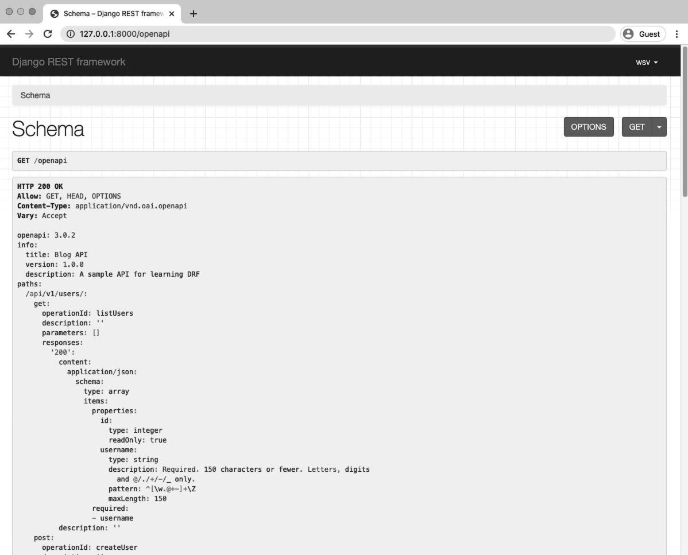
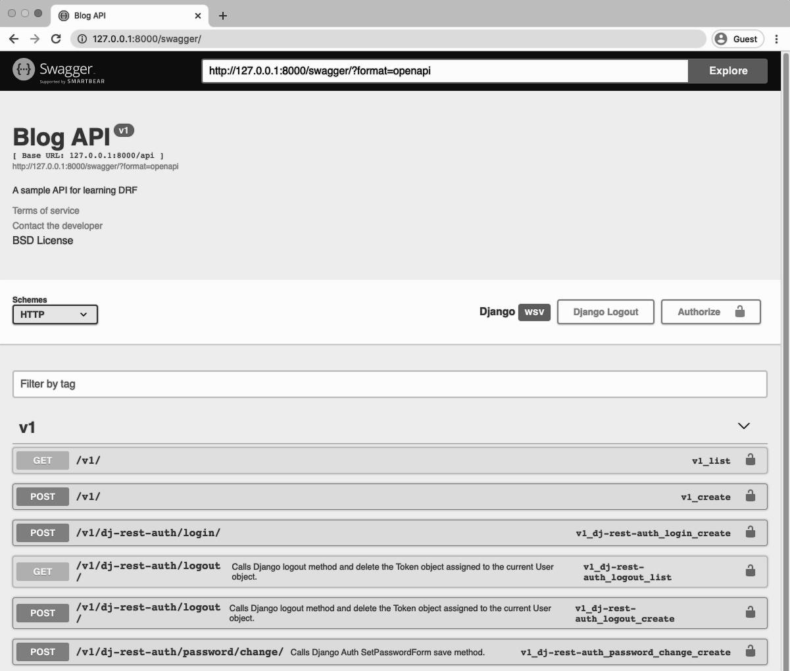
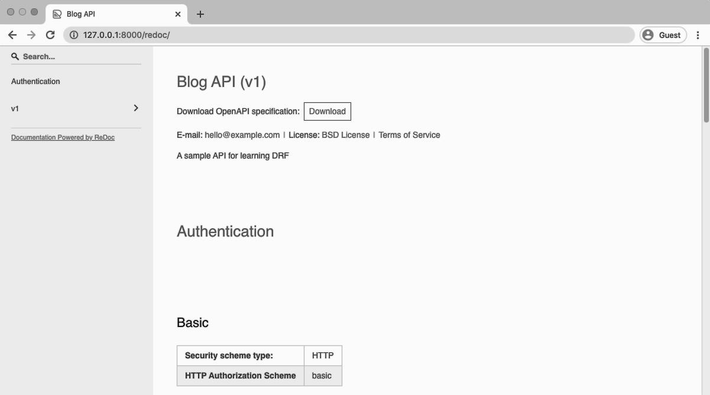

<div dir="rlt">
  
# Schemas and Documentation
  

Now that we have our API complete we need a way to document its functionality quickly and
accurately to others. After all, in most companies and teams, the developer who is using the API
is not the same developer who initially built it. Fortunately, there are automated tools to handle
this for us.
  
A [schema](https://www.django-rest-framework.org/api-guide/schemas/#schema) 
is a machine-readable document that outlines all available API endpoints, URLs, and
the HTTP verbs (GET, POST, PUT, DELETE, etc.) they support. Documentation is something added
to a schema that makes it easier for humans to read and consume. In this chapter we will add a
schema to our Blog project and then add two different documentation approaches. By the end
we will we have implemented an automated way to document any current and future changes
to our API.
  
  
  
As a reminder, here is the complete list of our current API endpoints:

<div dir="ltr">
  
Diagram
```code
|Endpoint                              |HTTP Verb|
|--------------------------------------|---------|
|/                                     |GET      |
|/:pk/                                 |GET      |
|users/                                |GET      |
|users/:pk/                            |GET      |
|/rest-auth/registration               |POST     |
|/rest-auth/login                      |POST     |
|/rest-auth/logout                     |GET      |
|/rest-auth/password/reset             |POST     |
|/rest-auth/password/reset/confirm     |POST     |
```
  
</div>
  
  
### Schemas
  
  
Before [version 3.9](https://www.django-rest-framework.org/community/3.9-announcement/), 
Django REST Framework relied on [Core API](http://www.coreapi.org/) for schemas but it has now
switched firmly over to the [OpenAPI](https://www.openapis.org/) schema (formerly known as Swagger).
  
The first step is to install both [PyYAML](https://pyyaml.org/) and [uritemplate](https://github.com/python-hyper/uritemplate). PyYAML will transform our schema
into the YAML-basd OpenAPI format, while uritemplate adds parameters to the URL paths.
  
  
<div dir="ltr">
  
Command Line
```shell
(blogapi) $ pipenv install pyyaml==5.3.1 uritemplate==3.0.1
```
  
</div>
  
  
Next, we are presented with a choice: generate a static schema or a dynamic schema. If your API
does not change often, the static schema can be generated periodically and served from static
files for strong performance. However, if your API does change quite often, you might consider
the dynamic option. We’ll implement both here.
  
First, is the static schema approach which uses the generateschema management command. We
can output the result to a file called openapi-schema.yml.
  
  
<div dir="ltr">
  
Command Line
```shell
(blogapi) $ python manage.py generateschema > openapi-schema.yml
```
  
</div>
  
  
If you open that file it’s quite long and not very human-friendly. But to a computer it’s perfectly
formatted.
  
For the dynamic approach, updating `config/urls.py` by importing `get_schema_view` at the top
and then creating a dedicated path at openapi. The title, description, and version can be
customized as needed.
  
  
<div dir="ltr">
  
Code
```python
# config/urls.py
from django.contrib import admin
from django.urls import include, path
from rest_framework.schemas import get_schema_view # new
  
  
urlpatterns = [
    path('admin/', admin.site.urls),
    path('api/v1/', include('posts.urls')),
    path('api-auth/', include('rest_framework.urls')),
    path('api/v1/dj-rest-auth/', include('dj_rest_auth.urls')),
    path('api/v1/dj-rest-auth/registration/',
          include('dj_rest_auth.registration.urls')),
    path('openapi', get_schema_view( # new
        title="Blog API",
        description="A sample API for learning DRF",
        version="1.0.0"
    ), name='openapi-schema'),
]

```
  
</div>
  
  
If you start the local server again with python manage.py runserver and navigate to our new
schema URL endpoint at http://127.0.0.1:8000/openapi the automatically generated schema
of our entire API is available.
  
  

  
Personally, I prefer the dynamic approach in projects.
  
  
### Documentation  
  
  
Django REST Framework also comes with a built-in API [documentation](https://www.django-rest-framework.org/topics/documenting-your-api/) 
feature that translates
schema into a much friendlier format for fellow developers.
  

Currently, there are three popular approaches here: using [SwaggerUI](https://swagger.io/tools/swagger-ui/) , [ReDoc](https://github.com/Rebilly/ReDoc), 
or the third party [drf-yasg](https://drf-yasg.readthedocs.io/en/stable/) package. Since drf-yasg is quite popular and comes with a lot of built-in
features, we’ll use it here.
  
  
Step one is to install the latest version of drf-yasg.
  
  
<div dir="ltr">
  
Command Line
```shell
(blogapi) $ pipenv install drf-yasg==1.17.1
```
  
</div>
  
  
Step two, add it to our INSTALLED_APPS configuration in `config/settings.py`. 
  
  
<div dir="ltr">
  
Code
```python
# config/settings.py
INSTALLED_APPS = [
    ...
    # 3rd-party apps
    'rest_framework',
    'rest_framework.authtoken',
    'allauth',
    'allauth.account',
    'allauth.socialaccount',
    'rest_auth',
    'rest_auth.registration',
    'drf_yasg', # new
  
    # Local
    'posts.apps.PostsConfig',
]
```
  
</div>
  
  
Step three, update our project-level `urls.py` file. At the top of the file we can replace DRF’s
`get_schema_view` with the one from `drf_yasg` as well as importing openapi. We’ll also add DRF’s
permission for additional options.
  
The `schema_view` variable is updated and includes additional fields such as `terms_of_service`,
contact, and license. Then under our urlpatterns we add paths for both Swagger and ReDoc.
  
  
<div dir="ltr">
  
Code
```python
# config/urls.py
from django.contrib import admin
from django.urls import include, path
from rest_framework import permissions # new
from drf_yasg.views import get_schema_view # new
from drf_yasg import openapi # new
  
schema_view = get_schema_view( # new
    openapi.Info(
        title="Blog API",
        default_version="v1",
        description="A sample API for learning DRF",
        terms_of_service="https://www.google.com/policies/terms/",
        contact=openapi.Contact(email="hello@example.com"),
        license=openapi.License(name="BSD License"),
    ),
    public=True,
    permission_classes=(permissions.AllowAny,),
)
  
urlpatterns = [
    path('admin/', admin.site.urls),
    path('api/v1/', include('posts.urls')),
    path('api-auth/', include('rest_framework.urls')),
    path('api/v1/dj-rest-auth/', include('dj_rest_auth.urls')),
    path('api/v1/dj-rest-auth/registration/',
          include('dj_rest_auth.registration.urls')),
    path('swagger/', schema_view.with_ui( # new
      'swagger', cache_timeout=0), name='schema-swagger-ui'),
    path('redoc/', schema_view.with_ui( # new
       'redoc', cache_timeout=0), name='schema-redoc'),
]
```
  
</div>
  
  
Make sure the local server is running. The Swagger endpoint is now available at:
  
http://127.0.0.1:8000/swagger/
  

  
  
Then confirm that the ReDoc view is also working at http://127.0.0.1:8000/redoc/.
  
  

  
  
The [drf-yasg docs](https://drf-yasg.readthedocs.io/en/stable/readme.html) are quite comprehensive and spell out many more customizations that can
be made, depending upon the needs of your API.
  
  
  
### Conclusion
  
  
Adding documentation is a vital part of any API. It is typically the first thing a fellow developer
looks at, either within a team or on an open-source projects. Thanks to the automated tools
covered in this chapter, ensuring your API has accurate, up-to-date documentation only requires
a small amount of configuration.
  
  
  
  
  
  
</div>
