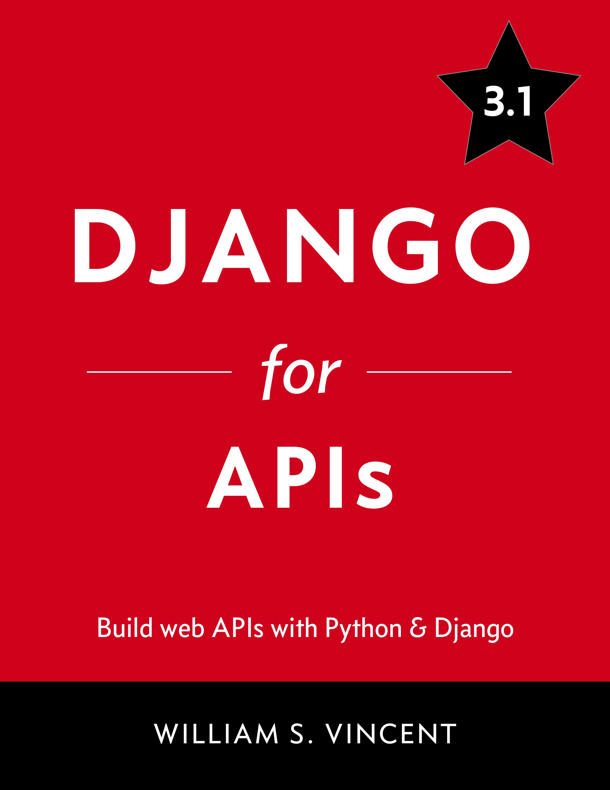

# ترجمه آزاد و گروهی کتاب Django for APIs: Build Web APIs with Python and Django

### فهرست مطالب

  
<a href="https://github.com/ftg-iran/dfa-persian/tree/main/00-introduction#%D9%85%D9%82%D8%AF%D9%85%D9%87">مقدمه</a> ✓

   
  
  - [پیش نیاز ها](https://github.com/ftg-iran/dfa-persian/tree/main/00-introduction#%D9%BE%DB%8C%D8%B4%D9%86%DB%8C%D8%A7%D8%B2%D9%87%D8%A7) ✓
  - [چرا API ها](https://github.com/ftg-iran/dfa-persian/tree/main/00-introduction#%DA%86%D8%B1%D8%A7-api-%D9%87%D8%A7) ✓
  - [چارچوب REST API جنگو](https://github.com/ftg-iran/dfa-persian/tree/main/00-introduction#%D9%81%D8%B1%DB%8C%D9%85-%D9%88%D8%B1%DA%A9-%D8%AC%D9%86%DA%AF%D9%88-rest) ✓
  - [چرا این کتاب](https://github.com/ftg-iran/dfa-persian/tree/main/00-introduction#%DA%86%D8%B1%D8%A7-%D8%A7%DB%8C%D9%86-%DA%A9%D8%AA%D8%A7%D8%A8) ✓
  - [نتیجه گیری](https://github.com/ftg-iran/dfa-persian/tree/main/00-introduction#%D9%86%D8%AA%DB%8C%D8%AC%D9%87-%DA%AF%DB%8C%D8%B1%DB%8C) ✓
  

  

  
<a href="https://github.com/ftg-iran/dfa-persian/tree/main/01-Web-APIs#web-apis">فصل اول : API های وب</a> ✓

   
  
  - [شبکه جهانی وب](https://github.com/ftg-iran/dfa-persian/tree/main/01-Web-APIs#%D8%B4%D8%A8%DA%A9%D9%87-%D8%AC%D9%87%D8%A7%D9%86%DB%8C-%D9%88%D8%A8) ✓
  - [URLs](https://github.com/ftg-iran/dfa-persian/tree/main/01-Web-APIs#urls) ✓
  - [Internet protocol suite](https://github.com/ftg-iran/dfa-persian/tree/main/01-Web-APIs#%D9%85%D8%AC%D9%85%D9%88%D8%B9%D9%87-%D9%BE%D8%B1%D9%88%D8%AA%DA%A9%D9%84-%D8%A7%DB%8C%D9%86%D8%AA%D8%B1%D9%86%D8%AA) ✓
  - [HTTP verbs](https://github.com/ftg-iran/dfa-persian/tree/main/01-Web-APIs#http-verbs) ✓
  - [Endpoints](https://github.com/ftg-iran/dfa-persian/tree/main/01-Web-APIs#endpoints) ✓
  - [HTTP](https://github.com/ftg-iran/dfa-persian/tree/main/01-Web-APIs#http) ✓
  - [Status codes](https://github.com/ftg-iran/dfa-persian/tree/main/01-Web-APIs#status-codes) ✓
  - [Statelessness](https://github.com/ftg-iran/dfa-persian/tree/main/01-Web-APIs#statelessness%D8%B9%D8%AF%D9%85-%D9%88%D8%A7%D8%A8%D8%B3%D8%AA%DA%AF%DB%8C) ✓
  - [Rest](https://github.com/ftg-iran/dfa-persian/tree/main/01-Web-APIs#rest) ✓
  - [نتیجه گیری](https://github.com/ftg-iran/dfa-persian/tree/main/01-Web-APIs#conclusion%D9%86%D8%AA%DB%8C%D8%AC%D9%87%DA%AF%DB%8C%D8%B1%DB%8C) ✓
  

  

  
<a href="https://github.com/ftg-iran/dfa-persian/tree/main/02-Library-Website-and-API#%DA%A9%D8%AA%D8%A7%D8%A8%D8%AE%D8%A7%D9%86%D9%87-%D8%B3%D8%A7%DB%8C%D8%AA-%D9%88-api">فصل دوم : API کتابخانه و سایت</a> ✓

   
  
  - [جنگو](https://github.com/ftg-iran/dfa-persian/tree/main/02-Library-Website-and-API#%D8%AC%D9%86%DA%AF%D9%88-%D9%85%D8%B1%D8%B3%D9%88%D9%85) ✓
  - [اولین برنامه](https://github.com/ftg-iran/dfa-persian/tree/main/02-Library-Website-and-API#%D8%A7%D9%88%D9%84%DB%8C%D9%86-%D8%A8%D8%B1%D9%86%D8%A7%D9%85%D9%87) ✓
  - [مدل ها](https://github.com/ftg-iran/dfa-persian/tree/main/02-Library-Website-and-API#%D9%85%D8%AF%D9%84-%D9%87%D8%A7) ✓
  - [ادمین](https://github.com/ftg-iran/dfa-persian/tree/main/02-Library-Website-and-API#%D9%85%D8%AF%DB%8C%D8%B1) ✓
  - [ویو ها](https://github.com/ftg-iran/dfa-persian/tree/main/02-Library-Website-and-API#%D9%86%D9%85%D8%A7-%D9%87%D8%A7views) ✓
  - [URLs](https://github.com/ftg-iran/dfa-persian/tree/main/02-Library-Website-and-API#%D9%85%DA%A9%D8%A7%D9%86-%DB%8C%D8%A7%D8%A8-%D9%87%D8%A7%DB%8C-%D9%85%D9%86%D8%A8%D8%B9-%DB%8C%DA%A9%D8%B3%D8%A7%D9%86urls) ✓
  - [Webpage](https://github.com/ftg-iran/dfa-persian/tree/main/02-Library-Website-and-API#%D8%B5%D9%81%D8%AD%D9%87-%D9%88%D8%A8) ✓
  - [Django rest framework](https://github.com/ftg-iran/dfa-persian/tree/main/02-Library-Website-and-API#%D8%B1%D8%B3%D8%AA-%D9%81%D8%B1%DB%8C%D9%85%D9%88%D9%88%D8%B1%DA%A9-%D8%AC%D9%86%DA%AF%D9%88django-rest-framework) ✓
  - [URLs](https://github.com/ftg-iran/dfa-persian/tree/main/02-Library-Website-and-API#%D9%85%D8%B3%DB%8C%D8%B1%D9%87%D8%A7urls) ✓
  - [Views](https://github.com/ftg-iran/dfa-persian/tree/main/02-Library-Website-and-API#%D9%86%D9%85%D8%A7-%D9%87%D8%A7) ✓
  - [Serializers](https://github.com/ftg-iran/dfa-persian/tree/main/02-Library-Website-and-API#%D8%B3%D8%B1%DB%8C%D8%A7%D9%84%D8%A7%DB%8C%D8%B2%D8%B1%D9%87%D8%A7serializers) ✓
  - [cURL](https://github.com/ftg-iran/dfa-persian/tree/main/02-Library-Website-and-API#%DA%A9%D9%90%D8%B1%D9%84curl) ✓
  - [Browsable API](https://github.com/ftg-iran/dfa-persian/tree/main/02-Library-Website-and-API#%D8%B1%D8%A7%D8%A8%D8%B7-%D8%A8%D8%B1%D9%86%D8%A7%D9%85%D9%87-%DA%A9%D8%A7%D8%B1%D8%A8%D8%B1%D8%AF%DB%8C-%D8%AA%D8%AD%D8%AA-%D9%85%D8%B1%D9%88%D8%B1%DA%AF%D8%B1browsable-api) ✓
  - [نتیجه گیری](https://github.com/ftg-iran/dfa-persian/tree/main/02-Library-Website-and-API#%D9%86%D8%AA%DB%8C%D8%AC%D9%87-%DA%AF%DB%8C%D8%B1%DB%8C) ✓
  

  

  
<a href="https://github.com/ftg-iran/dfa-persian/tree/main/03-Todo-API#todo-api">فصل سوم : TODO API</a> ✓

   

  - [تنظیمات اولیه](https://github.com/ftg-iran/dfa-persian/tree/main/03-Todo-API#%D8%AA%D9%86%D8%B8%DB%8C%D9%85%D8%A7%D8%AA-%D8%A7%D9%88%D9%84%DB%8C%D9%87) ✓
  - [Models](https://github.com/ftg-iran/dfa-persian/tree/main/03-Todo-API#%D9%85%D8%AF%D9%84%D9%87%D8%A7) ✓
  - [Django REST framework](https://github.com/ftg-iran/dfa-persian/tree/main/03-Todo-API#django-rest-framework) ✓
  - [URLs](https://github.com/ftg-iran/dfa-persian/tree/main/03-Todo-API#urls) ✓
  - [Serializers](https://github.com/ftg-iran/dfa-persian/tree/main/03-Todo-API#%D8%B3%D8%B1%DB%8C%D8%A7%D9%84-%D8%B3%D8%A7%D8%B2-%D9%87%D8%A7) ✓
  - [Views](https://github.com/ftg-iran/dfa-persian/tree/main/03-Todo-API#views) ✓
  - [Consuming the API](https://github.com/ftg-iran/dfa-persian/tree/main/03-Todo-API#%D9%85%D8%B5%D8%B1%D9%81-api) ✓
  - [Browsable APIs](https://github.com/ftg-iran/dfa-persian/tree/main/03-Todo-API#api-%D9%82%D8%A7%D8%A8%D9%84-%D9%85%D8%B1%D9%88%D8%B1) ✓
  - [CORS](https://github.com/ftg-iran/dfa-persian/tree/main/03-Todo-API#cors) ✓
  - [Tests](https://github.com/ftg-iran/dfa-persian/tree/main/03-Todo-API#%D8%AA%D8%B3%D8%AA-%D9%87%D8%A7) ✓
  - [نتیجه گیری](https://github.com/ftg-iran/dfa-persian/tree/main/03-Todo-API#%D9%86%D8%AA%DB%8C%D8%AC%D9%87-%DA%AF%DB%8C%D8%B1%DB%8C) ✓
  

  

  
<a href="https://github.com/ftg-iran/dfa-persian/tree/main/04-Todo-React-Front-end#%D9%81%D8%B5%D9%84-4-todo-react-front-end">فصل چهارم : برنامه TODO با فرانت اند React</a> ✓

   
  
  - [نصب Node](https://github.com/ftg-iran/dfa-persian/tree/main/04-Todo-React-Front-end#%D9%86%D8%B5%D8%A8-node) ✓
  - [نصب React](https://github.com/ftg-iran/dfa-persian/tree/main/04-Todo-React-Front-end#%D9%86%D8%B5%D8%A8-react) ✓
  - [Mock data](https://github.com/ftg-iran/dfa-persian/tree/main/04-Todo-React-Front-end#%D9%85%D8%A7%DA%A9-%D8%AF%DB%8C%D8%AA%D8%A7) ✓
  - [Django rest framwork](https://github.com/ftg-iran/dfa-persian/tree/main/04-Todo-React-Front-end#%D9%81%D8%B1%DB%8C%D9%85-%D9%88%D8%B1%DA%A9-%D8%B1%D8%B3%D8%AA-%D8%AC%D9%86%DA%AF%D9%88--react) ✓
  - [نتیجه گیری](https://github.com/ftg-iran/dfa-persian/tree/main/04-Todo-React-Front-end#%D9%86%D8%AA%DB%8C%D8%AC%D9%87-%DA%AF%DB%8C%D8%B1%DB%8C) ✓
  

  

  
<a href="https://github.com/ftg-iran/dfa-persian/tree/main/05-Blog-Api#%D9%81%D8%B5%D9%84-5-%D8%A7%DB%8C-%D9%BE%DB%8C-%D8%A2%DB%8C-%D9%88%D8%A8%D9%84%D8%A7%DA%AF">فصل پنجم : API بلاگ</a> ✓

   
  
  - [تنظیمات اولیه](https://github.com/ftg-iran/dfa-persian/tree/main/05-Blog-Api#%D8%AA%D9%86%D8%B8%DB%8C%D9%85%D8%A7%D8%AA-%D8%A7%D9%88%D9%84%DB%8C%D9%87) ✓
  - [Models](https://github.com/ftg-iran/dfa-persian/tree/main/05-Blog-Api#%D9%85%D8%AF%D9%84) ✓
  - [Tests](https://github.com/ftg-iran/dfa-persian/tree/main/05-Blog-Api#%D8%AA%D8%B3%D8%AA-%D9%87%D8%A7) ✓
  - [Django rest framwork](https://github.com/ftg-iran/dfa-persian/tree/main/05-Blog-Api#%D8%AC%D9%86%DA%AF%D9%88-%D8%B1%D8%B3%D8%AA-%D9%81%D8%B1%DB%8C%D9%85%D9%88%D8%B1%DA%A9) ✓
  - [URLs](https://github.com/ftg-iran/dfa-persian/tree/main/05-Blog-Api#url-%D9%87%D8%A7) ✓
  - [Serializers](https://github.com/ftg-iran/dfa-persian/tree/main/05-Blog-Api#%D8%B3%D8%B1%DB%8C%D8%A7%D9%84%D8%A7%DB%8C%D8%B2%D8%B1%D9%87%D8%A7) ✓
  - [Views](https://github.com/ftg-iran/dfa-persian/tree/main/05-Blog-Api#%D9%88%DB%8C%D9%88%D9%87%D8%A7) ✓
  - [Browsable APIs](https://github.com/ftg-iran/dfa-persian/tree/main/05-Blog-Api#%D8%A7%DB%8C-%D9%BE%DB%8C-%D8%A2%DB%8C-%D9%82%D8%A7%D8%A8%D9%84-%D9%85%D8%B1%D9%88%D8%B1) ✓
  - [نتیجه گیری](https://github.com/ftg-iran/dfa-persian/tree/main/05-Blog-Api#%D9%86%D8%AA%DB%8C%D8%AC%D9%87-%DA%AF%DB%8C%D8%B1%DB%8C) ✓
  

  

  
<a href="https://github.com/ftg-iran/dfa-persian/tree/main/06-Permissions#%D9%85%D8%AC%D9%88%D8%B2%D9%87%D8%A7">فصل ششم : مجوز ها</a> ✓

   
  
  - [ایجاد کاربر جدید](https://github.com/ftg-iran/dfa-persian/tree/main/06-Permissions#%D8%A7%DB%8C%D8%AC%D8%A7%D8%AF-%DA%A9%D8%A7%D8%B1%D8%A8%D8%B1-%D8%AC%D8%AF%DB%8C%D8%AF) ✓
  - [Add login to the browsable API](https://github.com/ftg-iran/dfa-persian/tree/main/06-Permissions#%D8%A7%D8%B6%D8%A7%D9%81%D9%87-%DA%A9%D8%B1%D8%AF%D9%86-%D9%82%D8%A7%D8%A8%D9%84%DB%8C%D8%AA-%D9%88%D8%B1%D9%88%D8%AF-%D8%A8%D9%87-api-%D9%82%D8%A7%D8%A8%D9%84-%D9%85%D8%B1%D9%88%D8%B1) ✓
  - [AllowAny](https://github.com/ftg-iran/dfa-persian/tree/main/06-Permissions#%D9%85%D8%AC%D9%88%D8%B2-%D8%A8%D8%B1%D8%A7%DB%8C-%D9%87%D9%85%D9%87) ✓
  - [View-Level Permissions](https://github.com/ftg-iran/dfa-persian/tree/main/06-Permissions#%D9%85%D8%AC%D9%88%D8%B2-%D8%AF%D8%B1-%D8%B3%D8%B7%D8%AD-%D9%86%D9%85%D8%A7) ✓
  - [Project-Level Permissions](https://github.com/ftg-iran/dfa-persian/tree/main/06-Permissions#%D9%85%D8%AC%D9%88%D8%B2-%D8%AF%D8%B1-%D8%B3%D8%B7%D8%AD-%D9%BE%D8%B1%D9%88%DA%98%D9%87) ✓
  - [Custom permissions](https://github.com/ftg-iran/dfa-persian/tree/main/06-Permissions#%D9%85%D8%AC%D9%88%D8%B2%D9%87%D8%A7%DB%8C-%D8%B3%D9%81%D8%A7%D8%B1%D8%B4%DB%8C) ✓
  - [نتیجه گیری](https://github.com/ftg-iran/dfa-persian/tree/main/06-Permissions#%D9%86%D8%AA%DB%8C%D8%AC%D9%87%DA%AF%DB%8C%D8%B1%DB%8C) ✓  

  

  
<a href="https://github.com/ftg-iran/dfa-persian/tree/main/07-User-Authentication#%D9%81%D8%B5%D9%84-%D9%87%D9%81%D8%AA%D9%85-%D8%A7%D8%AD%D8%B1%D8%A7%D8%B2-%D9%87%D9%88%DB%8C%D8%AA-%DA%A9%D8%A7%D8%B1%D8%A8%D8%B1">فصل هفتم : احراز هویت کاربر</a> ✓

   

  - [احراز هویت اولیه](https://github.com/ftg-iran/dfa-persian/tree/main/07-User-Authentication#%D8%A7%D8%AD%D8%B1%D8%A7%D8%B2-%D9%87%D9%88%DB%8C%D8%AA-%D9%BE%D8%A7%DB%8C%D9%87) ✓
  - [Session authentication](https://github.com/ftg-iran/dfa-persian/tree/main/07-User-Authentication#%D8%A7%D8%AD%D8%B1%D8%A7%D8%B2-%D9%87%D9%88%DB%8C%D8%AA-%D9%85%D8%A8%D8%AA%D9%86%DB%8C-%D8%A8%D8%B1-%D8%AC%D9%84%D8%B3%D9%87) ✓
  - [Token authentication](https://github.com/ftg-iran/dfa-persian/tree/main/07-User-Authentication#%D8%A7%D8%AD%D8%B1%D8%A7%D8%B2-%D9%87%D9%88%DB%8C%D8%AA-%D9%85%D8%A8%D8%AA%D9%86%DB%8C-%D8%A8%D8%B1-%D8%AA%D9%88%DA%A9%D9%86) ✓
  - [Default authentication](https://github.com/ftg-iran/dfa-persian/tree/main/07-User-Authentication#%D8%A7%D8%AD%D8%B1%D8%A7%D8%B2-%D9%87%D9%88%DB%8C%D8%AA-%D9%BE%DB%8C%D8%B4-%D9%81%D8%B1%D8%B6) ✓
  - [Implementing token authentication](https://github.com/ftg-iran/dfa-persian/tree/main/07-User-Authentication#%D9%BE%DB%8C%D8%A7%D8%AF%D9%87-%D8%B3%D8%A7%D8%B2%DB%8C-%D8%A7%D8%AD%D8%B1%D8%A7%D8%B2-%D9%87%D9%88%DB%8C%D8%AA-%D9%85%D8%A8%D8%AA%D9%86%DB%8C-%D8%A8%D8%B1-%D8%AA%D9%88%DA%A9%D9%86) ✓
  - [Endpoints](https://github.com/ftg-iran/dfa-persian/tree/main/07-User-Authentication#%D9%86%D9%82%D8%A7%D8%B7-%D9%BE%D8%A7%DB%8C%D8%A7%D9%86%DB%8Cendpoints) ✓
  - [dj-rest-auth](https://github.com/ftg-iran/dfa-persian/tree/main/07-User-Authentication#%D9%BE%DA%A9%DB%8C%D8%AC-dj-rest-auth) ✓
  - [User registration](https://github.com/ftg-iran/dfa-persian/tree/main/07-User-Authentication#%D8%AB%D8%A8%D8%AA-%D9%86%D8%A7%D9%85-%DA%A9%D8%A7%D8%B1%D8%A8%D8%B1) ✓
  - [Tokens](https://github.com/ftg-iran/dfa-persian/tree/main/07-User-Authentication#%D8%AA%D9%88%DA%A9%D9%86%D9%87%D8%A7) ✓
  - [نتیجه گیری](https://github.com/ftg-iran/dfa-persian/tree/main/07-User-Authentication#%D9%86%D8%AA%DB%8C%D8%AC%D9%87-%DA%AF%DB%8C%D8%B1%DB%8C) ✓

  

  
<a href="https://github.com/ftg-iran/dfa-persian/tree/main/08-Viewsets-and-Routers#%D9%88%DB%8C%D9%88%D8%B3%D8%AA-%D9%88-%D8%B1%D9%88%D8%AA%D8%B1-%D9%87%D8%A7-viewsets-and-routers">فصل هشتم : نماها و مسیر ها</a> ✓

   

  - [نقاط پایانی کاربر](https://github.com/ftg-iran/dfa-persian/tree/main/08-Viewsets-and-Routers#%D8%A7%D9%86%D8%AF%D9%BE%D9%88%DB%8C%D9%86%D8%AA-%D9%87%D8%A7%DB%8C-%DA%A9%D8%A7%D8%B1%D8%A8%D8%B1-user-endpoints) ✓
  - [نما ها](https://github.com/ftg-iran/dfa-persian/tree/main/08-Viewsets-and-Routers#%D9%88%DB%8C%D9%88%D8%B3%D8%AA-%D9%87%D8%A7-viewsets) ✓
  - [مسیر ها](https://github.com/ftg-iran/dfa-persian/tree/main/08-Viewsets-and-Routers#%D8%B1%D9%88%D8%AA%D8%B1%D9%87%D8%A7) ✓
  - [نتیجه گیری](https://github.com/ftg-iran/dfa-persian/tree/main/08-Viewsets-and-Routers#%D9%86%D8%AA%DB%8C%D8%AC%D9%87-%DA%AF%DB%8C%D8%B1%DB%8C) ✓
  

  

  
<a href="https://github.com/ftg-iran/dfa-persian/tree/main/09-Schemas-and-Documentation#%D8%A7%D9%84%DA%AF%D9%88-%D9%87%D8%A7-schemas-%D9%88-%D9%85%D8%B3%D8%AA%D9%86%D8%AF%D8%A7%D8%AA">فصل نهم : طرح ها و مستندات</a> ✓

   
  
  - [طرح ها](https://github.com/ftg-iran/dfa-persian/tree/main/09-Schemas-and-Documentation#schemas) ✓
  - [مستندات](https://github.com/ftg-iran/dfa-persian/tree/main/09-Schemas-and-Documentation#%D9%85%D8%B3%D8%AA%D9%86%D8%AF%D8%A7%D8%AA) ✓
  - [نتیجه گیری](https://github.com/ftg-iran/dfa-persian/tree/main/09-Schemas-and-Documentation#%D9%86%D8%AA%DB%8C%D8%AC%D9%87) ✓

  

  
<a href="https://github.com/ftg-iran/dfa-persian/tree/main/Conclusion#%D9%86%D8%AA%DB%8C%D8%AC%D9%87-%DA%AF%DB%8C%D8%B1%DB%8C">نتیجه گیری</a> ✓

   
  
  - [مراحل بعد](https://github.com/ftg-iran/dfa-persian/tree/main/Conclusion#%D9%82%D8%AF%D9%85-%D8%A8%D8%B9%D8%AF%DB%8C) ✓
  - [تشکر کردن](https://github.com/ftg-iran/dfa-persian/tree/main/Conclusion#%D8%B3%D9%BE%D8%A7%D8%B3-%DA%AF%D8%B2%D8%A7%D8%B1%DB%8C) ✓
  

  

  
| تاریخ اتمام ترجمه |       مترجم      |             فصل             |
|:-----------------:|:----------------:|:---------------------------:|
|       تمام        |  Mostafa Karimi  |                introduction |
|       تمام        |Khalil Farashiani |                  Web-APIs-1 |
|       تمام       |Seyyed Mahdi Sepahbodi|   Library-Website-and-API-2 |
|       تمام         |    Mehdi Ebrahimi   |                  Todo-API-3 |
|       تمام        |  Sahar Mokarrami |      Todo-React-Front-end-4 |
|       تمام        | Shamim Sanisales |                  Blog-Api-5 |
|       تمام       |   Pouya Pargam   |               Permissions-6 |
|        تمام       |       ELI        |       User-Authentication-7 |
|        تمام       | Amirreza Pasandi & Khalil Farashiani |      Viewsets-and-Routers-8 |
|         تمام         |   Reza Mobaraki  | Schemas-and-Documentation-9 |
|         تمام         | khalil farashiani|                  Conclusion |
  

## ممنون از افرادی که در ترجمه این کتاب مشارکت داشتند :heart:

